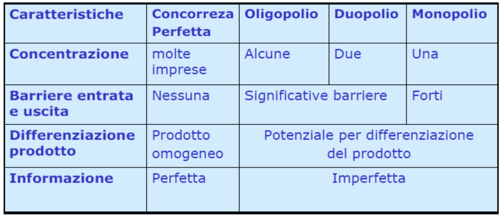
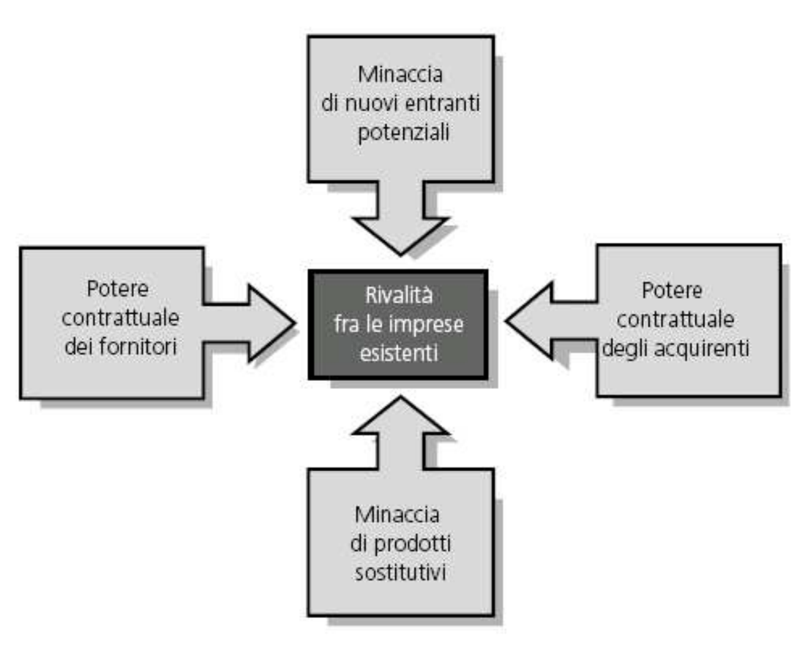
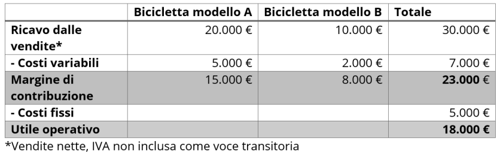

# Lezione 16

# Margine di contribuzione

## Definizione

Per **margine di contribuzione** (MdC) si intende la differenza tra il fatturato e i costi variabili di un'impresa.

Può essere calcolato:

- per un prodotto
- per un gruppo di prodotti
- per l'intero volune di vendite

Per trarre profitto c'è bisogno che il margine di contribuzione complessivo debba essere superiore ai costi fissi.
Questo importante valore viene definito nel conto dei costi e delle prestazioni come l'importo che un'azienda ha a disposizione, in base al fatturato, per coprire i propri costi fissi.

Esso fornisce informazioni circa quanto la rispettiva quota del fatturato contribuisca a coprire i costi fissi.

I **costi fissi** coincidono con i costi sostenuti indipendentemente dal fatturato dell'impresa:

- Affitti
- Interessi
- Ammortamenti
- Costi Salariali (in alcuni casi)

I **costi variabili** sono tutti i costi che aumentano o diminuiscono in rapporto alle quantità prodotte, ad esempio:

- Materie prime
- Costi di trasporto

## Come utilizzarlo

Il margine di contribuzione fornisce riulti significativi **se posto in relazione con altri valori**:

1. Se si confronta il margine di contribuzione con i costi fissi si può determinare se l'azienda realizza profitti o perdite;
2. Se il MdC dell'azienda viene confrontato con la sua clientala può consentire di individuare clienti particolarmente preziosi.

## Lettura

- **MdC > costi fissi**: l'azienda realizza profitti, le entrate superano le uscite;
- **MdC = costi fissi**: il risultato delle normali attività commerciali è appena bilanciato (**punto di pareggio**);
- **MdC < costi fissi**: l'azienda registra perdite in quanto le uscite superano le entrate.

Il risultato può essere migliorato:

1. Riducendo i costi variabili nel consumo di materie prime o nel processo di produzione;
2. Aumentando il fatturato ad esempio attraverso le vendite o riducento i costi fissi.

## Algortimo di Calcolo

Si distingue tra il **margine unitario** e il **margine di contribuzione totale**, i quali possono essere calcolari mediante le rispettive formule del margine di contribuzuione:

- **Margine di contriubuzione unitario**: differenza tra il prezzo unitario `p` e i costi unitari variabili `cv` .
  $$M_dC_u = p - CV$$

- **Margine di contribuzione totale**: moltiplicando il margine di contribuzione unitario `MdCu` per il volume delle vendite `x` si ottiene il margine di ocntribuzione totale `MdC`.
  Con il margine di contribuzione otale è possibile determinare il prodotto o il servizio abbia contribuito nel complesso (in un determinato periodo di tempo).
  $$M_dC = M_dC_u \times x$$

## Come eseguire il calcolo

Per determinare il margine di contribuzione unitario e il margine di contribuzione totale è possibile utilizzare **calcoli a uno o più livelli**.

Il margine di contribuzione relativo consente di determinare un programma di produzione ottimizzato.
Il risultato del calcolo del margine di contribuzione a livello unico fornisce informazioni sulla redditività dell'azienda del suo complesso ese p quindi di particolare interesse per le decisioni impreditoriali generali.
Con il **calcolo del margine di contribuzione multilivello**, invece è possibile esaminare:

- La redditività dei singoli prodotti
- La redditività di gruppi di prodotti
- La redditività di aree di business

## Livelli del margine di contribuzione

A seconda di quali e quanti costi venga sottratto ai ricavi, è possibile ottenere:

- Margine di primo livello
- Margine di secondo livello
- Margine di terzo livello

Essendo un calcolo tipico del Controllo di Gestione, la scelta del nome e il metodo del calcolo può essere discrezionale.

Detto ciò, generalmente, primo secondo e terzo riguardano il margine dopo:

1. Costi diretti variabili
2. Costi fissi specifici (e variabili a riparto)
3. Costi fissi generali

## Calcolo del margine di contribuzione di primo livello

Nel calcolo del margine di contribuzione di pitmo livello si ottiene il risultato operativo detraendo il totale dei costi fissi dal margine di contribuzione totale.
I costi fissi non vengono differenziati, dal momento che non sono considerati influenzabili nel calcolo del margine di contribuzione di primo livello nel periodo in esame.

Il risultato operativo rappresenta il successo economico dell'unità aziendale considerata, cioè il relativo profitto o la perdita.

$$M_dC \text{ I° livello} = Ricavi - (Materiali, Mandodopera, Lavorazioni esterne)$$

### Esempio di calcolo del margine di contribuzione

> Nel calcolo del margine di contribuzione di primo livelli si detraggono i costi fissi dal margine di contribuzione

1. Per ogni singolo ricavo parziale si calcola il margine di contribuzione sottraendo i costi variabili dai rispettivi ricavi di vendita

   > Il modello di bicicletta A realizza un ricavo di 20k€ con costi variabili pari a 5k€. Il margine di contribuzione è quindi pari a 15k€.

2. Si sommano i singoli margini di contribuzione per determinare il margine di contribuzione totale
3. Si sottrae il totale dei costi fissi dal margine di contribuzione totale per ottenere l'utile operativo.
   > Nell'esempio il margine di contribuzione totale è di 23k€. Tenendo conto dei costi fissi di 5k€ si ottiene un risultato operativo pari a 18k€.

## Calcolo del margine di contribuzione multilivello

A differenza del margine di contribuzione di primo livello, questo **considera i costi fissi su più livelli separati** l'uno dall'altro.

Tale differenziazione può assumere forme molto diverse.

**Lo scopo del calcolo dei margini di contribuzione multilivello è quello di determinare la redditività degli oggetti di riferimento in conformità con le relative cause e nel modo più trasparente possibile.**
- **Costi specifici dl prodotto** = i costi possono essere attribuiti in modo preciso a un prodotto o servizio (ad esempio l'ammortamento di una macchina utilizzata per produrre il modello di biciclette A);
- **Costi fissi per area** = i costi possono essere attribuiti a un'area aziendale (ad esempio per l'officina di produzione di bicilette);
- **Costi aziendali fissi** = si intendono i costi fissi generali che non possono essere imputati a un prodotto o a un'area (Ad esempio gli stipendi amministrativi).

### Esempio di calcolo del margine di contribuzione di multilivello

1. Calcolare per ogni prodotto il margine di contribuzione e poi sommare i singoli importi **al margine di contribuzione di primo livello**.
2. Una volta determinato il margine di contribuzione specifico per ogni prodotto, **si sottraggono i costi fissi corrispondenti per ottenre il margine di contribuzione di secondo livello dei singoli prodotti.** La somma dei margini di contribuzione II di ciascun prodotto di un'area ne determina il margine di contribuzione II corrispondente, mentre il totale di questi importi determina a suoa volta il margine di contribuzione II dell'azienda nel suo complesso.
3. Sottraete i costi fissi dell'area dal margine di contribuzioneII di ciascuna area. In questo modo si ottiene il **margine di contribuzione di terzo livello per ogni area**.
4. Sommando i singoli margini di contribuzione III è possibile determinare il margine di contribuzione di terzo livello dell'azienda nel suo complesso.
5. Per ottenere **il risultato operativo**, si sottraggono nell'ultimo passaggio i costi fissi aziendali dal margine di contribuzione III così determinato.

## Calcolo del margine di contribuzione di secondo livello
Una volta calcolata il margine di primo livello, è possibile calcolare il margine di secondo livello sottraendo al primo i costi fissi specifici.
I costi fissi specifici sono detti così in quanto:
- **Fissi**: non cambiano nel corso del tempo e non sono proporzionali alla produzione;
- **Specifici**: partecipano alla creazione del prodotto (e non di altri).

Alcuni esempi potrebbero essere:
- Ammortamento di macchinari deputati esclusivamente alla creazione del prodotto
- Manutenzioni
- Consulenze tecniche esclusive
- Leasing del macchinario specifico

Una volta riconosciuti tali costi, la formula è la seguente:
$$M_dC \text{ II° livello} = M_dC \text{ I° livello} - \text{Costi Fissi Specifici}$$

## Il margine di contribuzione relativo
