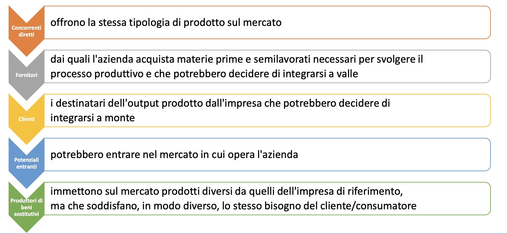

# Table of Contents
- [Table of Contents](#table-of-contents)
- [Lezione 16](#lezione-16)
- [Margine di contribuzione](#margine-di-contribuzione)
  - [Definizione](#definizione)
  - [Come utilizzarlo](#come-utilizzarlo)
  - [Lettura](#lettura)
  - [Algortimo di Calcolo](#algortimo-di-calcolo)
  - [Come eseguire il calcolo](#come-eseguire-il-calcolo)
  - [Livelli del margine di contribuzione](#livelli-del-margine-di-contribuzione)
  - [Calcolo del margine di contribuzione di primo livello](#calcolo-del-margine-di-contribuzione-di-primo-livello)
    - [Esempio di calcolo del margine di contribuzione](#esempio-di-calcolo-del-margine-di-contribuzione)
  - [Calcolo del margine di contribuzione multilivello](#calcolo-del-margine-di-contribuzione-multilivello)
    - [Esempio di calcolo del margine di contribuzione di multilivello](#esempio-di-calcolo-del-margine-di-contribuzione-di-multilivello)
  - [Calcolo del margine di contribuzione di secondo livello](#calcolo-del-margine-di-contribuzione-di-secondo-livello)
  - [Il margine di contribuzione relativo](#il-margine-di-contribuzione-relativo)
    - [Esempi di calcolo di margine di contribuzione relativo](#esempi-di-calcolo-di-margine-di-contribuzione-relativo)
  - [Perchè calcolare i margini di retribuzione](#perchè-calcolare-i-margini-di-retribuzione)
  - [Limiti dell'analisi del margine di contribuzione](#limiti-dellanalisi-del-margine-di-contribuzione)
  - [Configurazioni di costo e mergini di contribuzione](#configurazioni-di-costo-e-mergini-di-contribuzione)
  - [Esercitazione 2: Utilizzo dei margini di contribuzione](#esercitazione-2-utilizzo-dei-margini-di-contribuzione)
- [Lezione 17](#lezione-17)
- [Il modello di break-even](#il-modello-di-break-even)
  - [Definizione](#definizione-1)
  - [Ipotesi e finalità](#ipotesi-e-finalità)
  - [Punto di pareggio: Ricavi Totali = Costi Totali](#punto-di-pareggio-ricavi-totali--costi-totali)
  - [Il volume di pareggio](#il-volume-di-pareggio)
  - [Il diagramma di profitto](#il-diagramma-di-profitto)
  - [Il modello di break-even in chiave algebrica](#il-modello-di-break-even-in-chiave-algebrica)
  - [Quantità e valore di break even](#quantità-e-valore-di-break-even)
    - [Caso Monoprodotto](#caso-monoprodotto)

# Lezione 16

# Margine di contribuzione

## Definizione

Per **margine di contribuzione** (MdC) si intende la differenza tra il fatturato e i costi variabili di un'impresa.

Può essere calcolato:

- per un prodotto
- per un gruppo di prodotti
- per l'intero volune di vendite

Per trarre profitto c'è bisogno che il margine di contribuzione complessivo debba essere superiore ai costi fissi.
Questo importante valore viene definito nel conto dei costi e delle prestazioni come l'importo che un'azienda ha a disposizione, in base al fatturato, per coprire i propri costi fissi.

Esso fornisce informazioni circa quanto la rispettiva quota del fatturato contribuisca a coprire i costi fissi.

I **costi fissi** coincidono con i costi sostenuti indipendentemente dal fatturato dell'impresa:

- Affitti
- Interessi
- Ammortamenti
- Costi Salariali (in alcuni casi)

I **costi variabili** sono tutti i costi che aumentano o diminuiscono in rapporto alle quantità prodotte, ad esempio:

- Materie prime
- Costi di trasporto

## Come utilizzarlo

Il margine di contribuzione fornisce riulti significativi **se posto in relazione con altri valori**:

1. Se si confronta il margine di contribuzione con i costi fissi si può determinare se l'azienda realizza profitti o perdite;
2. Se il MdC dell'azienda viene confrontato con la sua clientala può consentire di individuare clienti particolarmente preziosi.

## Lettura

- **MdC > costi fissi**: l'azienda realizza profitti, le entrate superano le uscite;
- **MdC = costi fissi**: il risultato delle normali attività commerciali è appena bilanciato (**punto di pareggio**);
- **MdC < costi fissi**: l'azienda registra perdite in quanto le uscite superano le entrate.

Il risultato può essere migliorato:

1. Riducendo i costi variabili nel consumo di materie prime o nel processo di produzione;
2. Aumentando il fatturato ad esempio attraverso le vendite o riducento i costi fissi.

## Algortimo di Calcolo

Si distingue tra il **margine unitario** e il **margine di contribuzione totale**, i quali possono essere calcolari mediante le rispettive formule del margine di contribuzuione:

- **Margine di contriubuzione unitario**: differenza tra il prezzo unitario `p` e i costi unitari variabili `cv` .
  $$M_dC_u = p - CV$$

- **Margine di contribuzione totale**: moltiplicando il margine di contribuzione unitario `MdCu` per il volume delle vendite `x` si ottiene il margine di ocntribuzione totale `MdC`.
  Con il margine di contribuzione otale è possibile determinare il prodotto o il servizio abbia contribuito nel complesso (in un determinato periodo di tempo).
  $$M_dC = M_dC_u \times x$$

## Come eseguire il calcolo

Per determinare il margine di contribuzione unitario e il margine di contribuzione totale è possibile utilizzare **calcoli a uno o più livelli**.

Il margine di contribuzione relativo consente di determinare un programma di produzione ottimizzato.
Il risultato del calcolo del margine di contribuzione a livello unico fornisce informazioni sulla redditività dell'azienda del suo complesso ese p quindi di particolare interesse per le decisioni impreditoriali generali.
Con il **calcolo del margine di contribuzione multilivello**, invece è possibile esaminare:

- La redditività dei singoli prodotti
- La redditività di gruppi di prodotti
- La redditività di aree di business

## Livelli del margine di contribuzione

A seconda di quali e quanti costi venga sottratto ai ricavi, è possibile ottenere:

- Margine di primo livello
- Margine di secondo livello
- Margine di terzo livello

Essendo un calcolo tipico del Controllo di Gestione, la scelta del nome e il metodo del calcolo può essere discrezionale.

Detto ciò, generalmente, primo secondo e terzo riguardano il margine dopo:

1. Costi diretti variabili
2. Costi fissi specifici (e variabili a riparto)
3. Costi fissi generali

## Calcolo del margine di contribuzione di primo livello

Nel calcolo del margine di contribuzione di pitmo livello si ottiene il risultato operativo detraendo il totale dei costi fissi dal margine di contribuzione totale.
I costi fissi non vengono differenziati, dal momento che non sono considerati influenzabili nel calcolo del margine di contribuzione di primo livello nel periodo in esame.

Il risultato operativo rappresenta il successo economico dell'unità aziendale considerata, cioè il relativo profitto o la perdita.

$$M_dC \text{ I° livello} = Ricavi - (Materiali, Mandodopera, Lavorazioni esterne)$$

### Esempio di calcolo del margine di contribuzione

> Nel calcolo del margine di contribuzione di primo livelli si detraggono i costi fissi dal margine di contribuzione

1. Per ogni singolo ricavo parziale si calcola il margine di contribuzione sottraendo i costi variabili dai rispettivi ricavi di vendita

   > Il modello di bicicletta A realizza un ricavo di 20k€ con costi variabili pari a 5k€. Il margine di contribuzione è quindi pari a 15k€.

2. Si sommano i singoli margini di contribuzione per determinare il margine di contribuzione totale
3. Si sottrae il totale dei costi fissi dal margine di contribuzione totale per ottenere l'utile operativo.
   > Nell'esempio il margine di contribuzione totale è di 23k€. Tenendo conto dei costi fissi di 5k€ si ottiene un risultato operativo pari a 18k€.

## Calcolo del margine di contribuzione multilivello

A differenza del margine di contribuzione di primo livello, questo **considera i costi fissi su più livelli separati** l'uno dall'altro.

Tale differenziazione può assumere forme molto diverse.

**Lo scopo del calcolo dei margini di contribuzione multilivello è quello di determinare la redditività degli oggetti di riferimento in conformità con le relative cause e nel modo più trasparente possibile.**

- **Costi specifici dl prodotto** = i costi possono essere attribuiti in modo preciso a un prodotto o servizio (ad esempio l'ammortamento di una macchina utilizzata per produrre il modello di biciclette A);
- **Costi fissi per area** = i costi possono essere attribuiti a un'area aziendale (ad esempio per l'officina di produzione di bicilette);
- **Costi aziendali fissi** = si intendono i costi fissi generali che non possono essere imputati a un prodotto o a un'area (Ad esempio gli stipendi amministrativi).

### Esempio di calcolo del margine di contribuzione di multilivello

1. Calcolare per ogni prodotto il margine di contribuzione e poi sommare i singoli importi **al margine di contribuzione di primo livello**.
2. Una volta determinato il margine di contribuzione specifico per ogni prodotto, **si sottraggono i costi fissi corrispondenti per ottenre il margine di contribuzione di secondo livello dei singoli prodotti.** La somma dei margini di contribuzione II di ciascun prodotto di un'area ne determina il margine di contribuzione II corrispondente, mentre il totale di questi importi determina a suoa volta il margine di contribuzione II dell'azienda nel suo complesso.
3. Sottraete i costi fissi dell'area dal margine di contribuzioneII di ciascuna area. In questo modo si ottiene il **margine di contribuzione di terzo livello per ogni area**.
4. Sommando i singoli margini di contribuzione III è possibile determinare il margine di contribuzione di terzo livello dell'azienda nel suo complesso.
5. Per ottenere **il risultato operativo**, si sottraggono nell'ultimo passaggio i costi fissi aziendali dal margine di contribuzione III così determinato.

## Calcolo del margine di contribuzione di secondo livello

Una volta calcolata il margine di primo livello, è possibile calcolare il margine di secondo livello sottraendo al primo i costi fissi specifici.
I costi fissi specifici sono detti così in quanto:

- **Fissi**: non cambiano nel corso del tempo e non sono proporzionali alla produzione;
- **Specifici**: partecipano alla creazione del prodotto (e non di altri).

Alcuni esempi potrebbero essere:

- Ammortamento di macchinari deputati esclusivamente alla creazione del prodotto
- Manutenzioni
- Consulenze tecniche esclusive
- Leasing del macchinario specifico

Una volta riconosciuti tali costi, la formula è la seguente:
$$M_dC \text{ II° livello} = M_dC \text{ I° livello} - \text{Costi Fissi Specifici}$$

## Il margine di contribuzione relativo

Il margine di contribuzione relativo mette in relazione:

- Il margine di contribuzione unitario
- IL cosiddetto fattore vincolante

Alcuni esempi sono la capacità di una macchina di produzione o di un dipendente.

Il margine di contribuzione relativo viene utilizzato per:

- Ottimizzare un origramma di produzione in caso di capacità limitate;
- Massimizzare il margine di contribuzione dell'untià di produzione interessata.

Per principio, la produzione di prodotti o servizi con un margine di contrivuzione previsto più elevato deve essere privilegiata.

Il margine di contribuzione relativo è calcolato secondo questa formula:
$$M_dR = \frac{M_dC_u}{\text{fattore vincolante per unità}}$$

### Esempi di calcolo di margine di contribuzione relativo

**Dati:**

- Il margine di contribuzione per il modello di bicicletta A è di 100€;
- Per la produzione viene utilizzata una determinata macchina per un'ora;
- Per il modello di bicicletta B, invece, il margine di contribuzione unitario è pari a 60€ ed è previsto un tempo di produzione di soli 30 minuti con la stessa macchina.

**Svolgimento:**

- Margine di contribuzione relativo $M_CR_A$ per la bicicletta A:
  $$M_CR = \frac{100€}{1h} = 100 €/h$$
- Margine di contribuzione relativo $M_CR_B$ per la bicicletta B:
  $$M_CR = \frac{60€}{0.5h} = 120 €/h$$

> **Dal calcolo emerge che il modello B ha un margine di contribuzione più elevato.**

Se la macchina rappresenta quindi effettivamente il fattore vincolante nella produzione e nella vendita dellebicilette, ovvero se tutte le altre stazioni di produzione e distribuzione hanno una capacità maggiore, la bicicletta B ha un margine di contribuzione più elevato rispetto alla bicicletta A, **per cui si dovrebbe privilegiare la sua produzione.**

La pratica non è così semplice!:

- Nel nostro esempio affinchè il calcolo sia correttom si dovrebbe produrre il doppio delle biciclette B rispetto a quelle di tipo A;
- Tuttavia, la domanda di biciclette B potrebbe non essere sufficiente per sfruttare al massimo la macchina;
- Il fattore vincolante quindi non sarebbe più la macchina, ma la vendita delle biciclette di tipo B;
- Il tal caso, il margine di contribuzione più elevato nella teoria non verrebbe raggiunto nella realtà.

## Perchè calcolare i margini di retribuzione

1. Ogni prodotto apporta un reddito differente dagli altri;
2. Il calcolo del margine di contribuzione è utile per capire quanto un determinato prodotto sia o meno redditizio;
3. Permette all'imprenditore di capire quanto sia proficuo produrre e vendere un determinato prodottom piuttosto che un altro;
4. Permette all'imprenditore di capire se la propria produzione caratterisitica (ovvero fino al II margine) riesca a coprire i costi fissi generali, generando così almeno un pareggio.

## Limiti dell'analisi del margine di contribuzione

1. **Non è adatta per imprese molto complesse, che hanno una moltitudine di prodotti** $\implies$ in questo caso è utile fare questa analisi per area geografica, per mercati o per canali di distribuzione;
2. **Non è sempre immediato suddividere i costi per ciascuna linea** $\implies$ solitamente i costi comuni sono molto elevati e quelli specifici più ridotti (analisi poco significativa);
3. **Non sempre è semplice suddividere i costi variabili e fissi**.

## Configurazioni di costo e mergini di contribuzione

## Esercitazione 2: Utilizzo dei margini di contribuzione
Raptor S.p.A produce tre prodotti differenti:
1. X;
2. Y;
3. Z;
Utilizzando due diversi materiali:
1. M1;
2. M2;
Tre componenti:
1.  C1;
2.  C2;
3.  C3;
E un macchinario dedicato che non può essere utilizzato per altre produzioni.

Dalla contabilità industriale della Raptor si ricavano le seguenti informazioni:

| | Lavoro diretto (ore) | Materiale M1 (kg) | Materiale M2 (kg) | Componente C1 (N) | Componente C2 (N) | Componente C3 (N) | Ore macchina |
|---|---|---|---|---|---|---|---|
|**Prodotto X**| | 1.5 | 1 | 2 | 2 | 1 | 2 | 2 | 
|**Prodotto Y**| 2 | 1.2 | 1 | 1 | 2 | 1 | 2.5 | 
|**Prodotto Z**| 1.2 | 2 | 1.5 | 1 | 1 | 2 | 3 | 
|**Costo** | 10 €/ora | 3 €/kg | 2 €/kg | 2 €/unità | 3 €/unità | 2 €/unità |  |

- Il prezzo di vendita del prodotto X è pari a 42€, il prezzo di Y è pari a 45€ e il prezzo di Z è pari a 40€;
- La produzione prevista per il 2021 è pari a 15.000 unità del prodotto X, 25.000 del prodotto Y e 20.000 unità del prodotto Z;
- Le ore macchina complessivamente disponibili nel corso dell'anno sono 160k.
- I costi indiretti di produzione sono complessivamente pari a 40k€ e sono legali all'ammortamento del macchinario e alla quota parte dell'affito del capannone industriale (calcolata sulla base dello spazio utilizzato dal macchinario);

a. Il direttore vendie ritiene possibile aumentare le vendite di 1k unità per uno dei tre prodotti. Di quale prodotto conviene aumentare la produzione?

b. La decisione cambierebbe in caso di saturazione della capacità produttiva dell'impianto? In tal caso, di quale pdotto converrebbe aumentare la produzione e di quale converrebbe ridurla?

> Soluzioni esercizio lezione 16.

# Lezione 17

# Il modello di break-even

## Definizione
Il modello di **break even** (analisi del punto di pareggio) ha la finalità di individuare il minimo volume di produzione che consente ad un'impresa di "coprire i costi".

Fornisce la risposta alle seguenti domande:
1. Qual è il livello di attività minimo che rende conveniente la produzione? (I ricavi devono coprire costi variabili e costi fissi);
2. Quanto devo produrre per "stare in piedi"?

## Ipotesi e finalità
Il modello di break-even si fonda su quattro ipotesi:
1. Impresa mono-prodotto
2. Linearità dei costi $\implies$ no economie di scala
3. Linearità dei ricavi $\implies$ invariabilità dei prezzi
4. No variazioni di scorte $\implies$ produzione = fatturato

> **Finalità:** Inidividuare il minimo volume operativo che conseta all'impresa di coprire i costi $\implies$ Tale volume prende il nome di **volume di pareggio o punto di pareggio**.

## Punto di pareggio: Ricavi Totali = Costi Totali

## Il volume di pareggio
**Si definisce volume di pareggio (break-even) o punto di pareggio (break-even point) quello in corrispondenza del quale i ricavi totali eguagliano i costi totali (operativi) e duqnue il reddito (operativo) è pari a zero**.

In formule:
$$Q_{be}|MON \implies Ricavi = Costi $$
$$MON = Ricavi - Costi = P\times Q - CF - CV_u \times Q = Q(P - CV_u) - CF$$
$$Q_{be} = \frac{CF}{(P - CV_u)} = \frac{CF}{MC_u}$$

## Il diagramma di profitto
Per modellizzare il punto di pareggio e analizzare la dinamica del reddito di un'impresa in relazione a decisioni che modifichino il livello di attività, nella prassi è molto usato lo strumento del **diagramma del profitto** (profit graph), o diagramma costo-volume-profitto (costo-volume-profit graph o C-V-P Graph).

Il diagramma del profitto:
- Mostra la relazione attesa tra ricavi totali e costi totali al variare del volume di output;
- Può essere costruito sia per l'impresa nel suo complesso sia per specifici segmenti di business, come:
  - Un prodotto (Kinder Brioss Latte)
  - Una line di prodotti (Kinder Brioss)
  - Una divisione di prodotti (Diviosione prodotti per colazione di ferrero)

## Il modello di break-even in chiave algebrica
**Hp**: n° unità prodotte = n° unità vendute = Q

p = prezzo di vendita unitario

m = (p-cv) = margine di contribuzione unitario

CF = Costi fissi totali

CT = Costi totali

cv = costo valore unitario
 
M = $M \times Q$ = margine di contribuzione totale

RT = ricavi totali

$\pi$ = profitti (utili)

$$\pi = RT - CT \rightarrow \pi = p \times Q - (CF + cv\times Q)$$

Conviene produrre se $\pi \geq 0 \rightarrow p \times Q - CF - cv\times Q \geq 0$,
quindi se $Q \geq \frac{CF}{m}$ con 
$$Q = \frac{CF}{p-CV} \implies \text{break even point}$$

## Quantità e valore di break even
### Caso Monoprodotto

$$Q_{be} \frac{CF}{P_u - CV_u} = \frac{CF}{MC_u}$$

$Q_{be}$ = Breakeven point (in quantità)