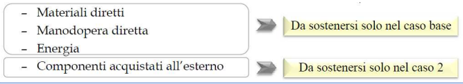
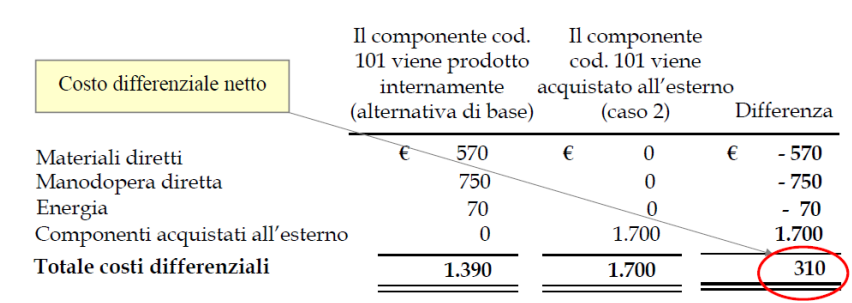
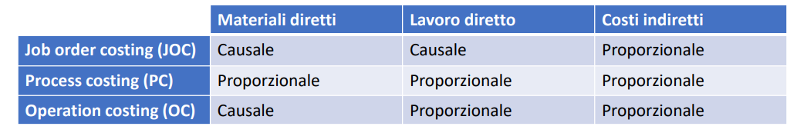
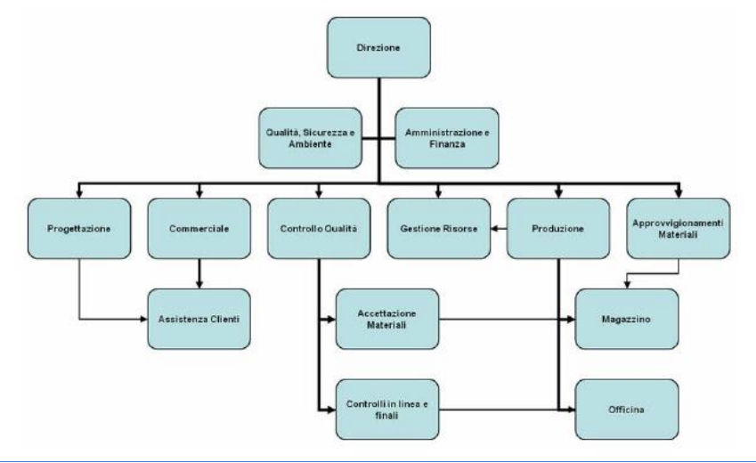

# Table of Contents

- [Table of Contents](#table-of-contents)
- [Lezione 16](#lezione-16)
- [Margine di contribuzione](#margine-di-contribuzione)
  - [Definizione](#definizione)
  - [Come utilizzarlo](#come-utilizzarlo)
  - [Lettura](#lettura)
  - [Algortimo di Calcolo](#algortimo-di-calcolo)
  - [Come eseguire il calcolo](#come-eseguire-il-calcolo)
  - [Livelli del margine di contribuzione](#livelli-del-margine-di-contribuzione)
  - [Calcolo del margine di contribuzione di primo livello](#calcolo-del-margine-di-contribuzione-di-primo-livello)
    - [Esempio di calcolo del margine di contribuzione](#esempio-di-calcolo-del-margine-di-contribuzione)
  - [Calcolo del margine di contribuzione multilivello](#calcolo-del-margine-di-contribuzione-multilivello)
    - [Esempio di calcolo del margine di contribuzione di multilivello](#esempio-di-calcolo-del-margine-di-contribuzione-di-multilivello)
  - [Calcolo del margine di contribuzione di secondo livello](#calcolo-del-margine-di-contribuzione-di-secondo-livello)
  - [Il margine di contribuzione relativo](#il-margine-di-contribuzione-relativo)
    - [Esempi di calcolo di margine di contribuzione relativo](#esempi-di-calcolo-di-margine-di-contribuzione-relativo)
  - [Perchè calcolare i margini di retribuzione](#perchè-calcolare-i-margini-di-retribuzione)
  - [Limiti dell'analisi del margine di contribuzione](#limiti-dellanalisi-del-margine-di-contribuzione)
  - [Configurazioni di costo e mergini di contribuzione](#configurazioni-di-costo-e-mergini-di-contribuzione)
  - [Esercitazione 2: Utilizzo dei margini di contribuzione](#esercitazione-2-utilizzo-dei-margini-di-contribuzione)
- [Lezione 17](#lezione-17)
- [Il modello di break-even](#il-modello-di-break-even)
  - [Definizione](#definizione-1)
  - [Ipotesi e finalità](#ipotesi-e-finalità)
  - [Punto di pareggio: Ricavi Totali = Costi Totali](#punto-di-pareggio-ricavi-totali--costi-totali)
  - [Il volume di pareggio](#il-volume-di-pareggio)
  - [Il diagramma di profitto](#il-diagramma-di-profitto)
  - [Il modello di break-even in chiave algebrica](#il-modello-di-break-even-in-chiave-algebrica)
  - [Quantità e valore di break even](#quantità-e-valore-di-break-even)
    - [Caso Monoprodotto](#caso-monoprodotto)
  - [Quantità target e reddito obiettivo](#quantità-target-e-reddito-obiettivo)
  - [Diagramma del profitto e reddito operativo](#diagramma-del-profitto-e-reddito-operativo)
  - [Break even, costi fissi e costi variabili](#break-even-costi-fissi-e-costi-variabili)
    - [CASO 1](#caso-1)
    - [CASO 2](#caso-2)
  - [Break Even e Margine di contribuzione](#break-even-e-margine-di-contribuzione)
  - [Volume di pareggio: un esempio](#volume-di-pareggio-un-esempio)
  - [Break-even in valore e margine di contribuzione percentuale](#break-even-in-valore-e-margine-di-contribuzione-percentuale)
  - [Margine di contribuzione percentuale: un esempio](#margine-di-contribuzione-percentuale-un-esempio)
    - [Risoluzione](#risoluzione)
  - [Le imprese multi-prodotto](#le-imprese-multi-prodotto)
    - [Margine di contribuzione del prodtto equivalente: esempio](#margine-di-contribuzione-del-prodtto-equivalente-esempio)
  - [Margine di sicurezza](#margine-di-sicurezza)
  - [Leva operativa e struttura dei costi](#leva-operativa-e-struttura-dei-costi)
    - [Leva operativa e struttura dei costi: un esempio](#leva-operativa-e-struttura-dei-costi-un-esempio)
  - [Grado di leva operativa, quantità, costi e ricavi: una visione d'insieme](#grado-di-leva-operativa-quantità-costi-e-ricavi-una-visione-dinsieme)
  - [Esercitazione 3: BEP](#esercitazione-3-bep)
- [Lezione 18](#lezione-18)
- [L'utilizzo dei costi per le decisioni di breve e lungo periodo.](#lutilizzo-dei-costi-per-le-decisioni-di-breve-e-lungo-periodo)
  - [Logiche nella misurazione dei Costi](#logiche-nella-misurazione-dei-costi)
  - [Pregi e difetti del costo diretto e del costo pieno](#pregi-e-difetti-del-costo-diretto-e-del-costo-pieno)
  - [Il supporto di decisioni di breve periodo](#il-supporto-di-decisioni-di-breve-periodo)
  - [Il supporto a decisioni di lungo periodo](#il-supporto-a-decisioni-di-lungo-periodo)
  - [Gli effetti motivazionali](#gli-effetti-motivazionali)
  - [Modelli di supporto alle decisioni di breve periodo](#modelli-di-supporto-alle-decisioni-di-breve-periodo)
  - [La scelta del mix ottimale di produzione](#la-scelta-del-mix-ottimale-di-produzione)
  - [Il problema matematico del mix ottimo](#il-problema-matematico-del-mix-ottimo)
    - [Il mix ottimo di produzione: un esempio](#il-mix-ottimo-di-produzione-un-esempio)
  - [Analisi della contribuzione](#analisi-della-contribuzione)
  - [Analisi della contribuzione: un'applicazione](#analisi-della-contribuzione-unapplicazione)
- [Lezione 19](#lezione-19)
- [Analisi make or buy, determinazione dei costi di prodotto, Job Order Costing.](#analisi-make-or-buy-determinazione-dei-costi-di-prodotto-job-order-costing)
  - [Scelta tra alternative e costi e ricavi differenziali](#scelta-tra-alternative-e-costi-e-ricavi-differenziali)
  - [Make or buy](#make-or-buy)
    - [un esempio](#un-esempio)
    - [I costi opportunità](#i-costi-opportunità)
    - [I costi invisibili](#i-costi-invisibili)
  - [Costi invisibili](#costi-invisibili)
    - [Un esempio nell'elettronica di consumo](#un-esempio-nellelettronica-di-consumo)
  - [I metodi per la determinazione dei costi di prodotto](#i-metodi-per-la-determinazione-dei-costi-di-prodotto)
  - [Il calcolo dei costi di prodotto](#il-calcolo-dei-costi-di-prodotto)
  - [Le tecniche di rilevazione dei costi](#le-tecniche-di-rilevazione-dei-costi)
  - [Rilevazione dei costi: i metodi tradizionali rilevazione dei costi](#rilevazione-dei-costi-i-metodi-tradizionali-rilevazione-dei-costi)
  - [Job Order Costing](#job-order-costing)
    - [Esempio di scheda](#esempio-di-scheda)
  - [Processo di allocazione dei costi indiretti:](#processo-di-allocazione-dei-costi-indiretti)
  - [Esercitazione 4](#esercitazione-4)
- [Lezione 21](#lezione-21)
- [Introduzione all'organizzazione d'impresa](#introduzione-allorganizzazione-dimpresa)
  - [L'organizzazione Interna](#lorganizzazione-interna)
    - [L'organizzazione interna: divisione e coordinamento](#lorganizzazione-interna-divisione-e-coordinamento)
    - [Organizzazione interna: i tre modelli di organizzazione aziendale](#organizzazione-interna-i-tre-modelli-di-organizzazione-aziendale)
    - [L'organizzazione intera: i meccanismi di coordinamento secondo Mintzberg](#lorganizzazione-intera-i-meccanismi-di-coordinamento-secondo-mintzberg)
  - [L'adattamento reciproco (mutuo aggiustamento)](#ladattamento-reciproco-mutuo-aggiustamento)
  - [La supervisione diretta](#la-supervisione-diretta)
  - [La standardizzazione dei processi produttivi](#la-standardizzazione-dei-processi-produttivi)
  - [La standardizzazione degli output](#la-standardizzazione-degli-output)
  - [La standardizzazione delle competenze](#la-standardizzazione-delle-competenze)
  - [L’organizzazione interna: l’organigramma](#lorganizzazione-interna-lorganigramma)
  - [Le strutture organizzative tradizionali](#le-strutture-organizzative-tradizionali)
  - [La struttura funzionale](#la-struttura-funzionale)
- [Lezione 22](#lezione-22)
- [La divisione del lavoro e i meccanismi di coordinamento.](#la-divisione-del-lavoro-e-i-meccanismi-di-coordinamento)
  - [Le parti dell'organizzazione secondo Mintztberg](#le-parti-dellorganizzazione-secondo-mintztberg)
  - [1. Il nucleo operativo](#1-il-nucleo-operativo)
- [2. Vertice strategico](#2-vertice-strategico)
  - [3. La linea intermedia](#3-la-linea-intermedia)
  - [4. La tecnostruttura](#4-la-tecnostruttura)
  - [5. Lo staff di supporto](#5-lo-staff-di-supporto)
  - [Il problema fondamentale dell'organizzazione](#il-problema-fondamentale-dellorganizzazione)
  - [I 5 meccanismi di coordinamento](#i-5-meccanismi-di-coordinamento)
  - [Il sistema organizzativo: modello sistemico](#il-sistema-organizzativo-modello-sistemico)
  - [Le variabili ambientali](#le-variabili-ambientali)
  - [Le variabili individuali](#le-variabili-individuali)
  - [Le variabili sociali](#le-variabili-sociali)
  - [Le variabili tecniche](#le-variabili-tecniche)
  - [Le variabili istituzionali](#le-variabili-istituzionali)
  - [Le variabili organizzative](#le-variabili-organizzative)
  - [Funzioni generali: il ruolo della struttura organizzativa](#funzioni-generali-il-ruolo-della-struttura-organizzativa)
  - [Approfondimento lessicale](#approfondimento-lessicale)
  - [Sistemi di ricerca, selezione, inserimento](#sistemi-di-ricerca-selezione-inserimento)
  - [Sistemi di addestramento e formazione](#sistemi-di-addestramento-e-formazione)
  - [Sistemi di carriera e di valutazione del potenziale](#sistemi-di-carriera-e-di-valutazione-del-potenziale)
  - [Sistema retributivo e i connessi sistemi di valutazione delle mansioni/prestazioni](#sistema-retributivo-e-i-connessi-sistemi-di-valutazione-delle-mansioniprestazioni)
  - [I sistemi di gestione del personale: una sintesi](#i-sistemi-di-gestione-del-personale-una-sintesi)
  - [Pianificazione, programmazione e controllo](#pianificazione-programmazione-e-controllo)
  - [L'organizzazione aziendale](#lorganizzazione-aziendale)
  - [Oggetto e obiettivi dell'organizzazione](#oggetto-e-obiettivi-dellorganizzazione)
  - [Affrontare i problemi organizzativi](#affrontare-i-problemi-organizzativi)
  - [L'approccio di progettazione "contingency"](#lapproccio-di-progettazione-contingency)

# Lezione 16

# Margine di contribuzione

## Definizione

Per **margine di contribuzione** (MdC) si intende la differenza tra il fatturato e i costi variabili di un'impresa.

Può essere calcolato:

- per un prodotto
- per un gruppo di prodotti
- per l'intero volune di vendite

Per trarre profitto c'è bisogno che il margine di contribuzione complessivo debba essere superiore ai costi fissi.
Questo importante valore viene definito nel conto dei costi e delle prestazioni come l'importo che un'azienda ha a disposizione, in base al fatturato, per coprire i propri costi fissi.

Esso fornisce informazioni circa quanto la rispettiva quota del fatturato contribuisca a coprire i costi fissi.

I **costi fissi** coincidono con i costi sostenuti indipendentemente dal fatturato dell'impresa:

- Affitti
- Interessi
- Ammortamenti
- Costi Salariali (in alcuni casi)

I **costi variabili** sono tutti i costi che aumentano o diminuiscono in rapporto alle quantità prodotte, ad esempio:

- Materie prime
- Costi di trasporto

## Come utilizzarlo

Il margine di contribuzione fornisce riulti significativi **se posto in relazione con altri valori**:

1. Se si confronta il margine di contribuzione con i costi fissi si può determinare se l'azienda realizza profitti o perdite;
2. Se il MdC dell'azienda viene confrontato con la sua clientala può consentire di individuare clienti particolarmente preziosi.

## Lettura

- **MdC > costi fissi**: l'azienda realizza profitti, le entrate superano le uscite;
- **MdC = costi fissi**: il risultato delle normali attività commerciali è appena bilanciato (**punto di pareggio**);
- **MdC < costi fissi**: l'azienda registra perdite in quanto le uscite superano le entrate.

Il risultato può essere migliorato:

1. Riducendo i costi variabili nel consumo di materie prime o nel processo di produzione;
2. Aumentando il fatturato ad esempio attraverso le vendite o riducento i costi fissi.

## Algortimo di Calcolo

Si distingue tra il **margine unitario** e il **margine di contribuzione totale**, i quali possono essere calcolari mediante le rispettive formule del margine di contribuzuione:

- **Margine di contriubuzione unitario**: differenza tra il prezzo unitario `p` e i costi unitari variabili `cv` .
  $$M_dC_u = p - CV$$

- **Margine di contribuzione totale**: moltiplicando il margine di contribuzione unitario `MdCu` per il volume delle vendite `x` si ottiene il margine di ocntribuzione totale `MdC`.
  Con il margine di contribuzione otale è possibile determinare il prodotto o il servizio abbia contribuito nel complesso (in un determinato periodo di tempo).
  $$M_dC = M_dC_u \times x$$

## Come eseguire il calcolo

Per determinare il margine di contribuzione unitario e il margine di contribuzione totale è possibile utilizzare **calcoli a uno o più livelli**.

Il margine di contribuzione relativo consente di determinare un programma di produzione ottimizzato.
Il risultato del calcolo del margine di contribuzione a livello unico fornisce informazioni sulla redditività dell'azienda del suo complesso ese p quindi di particolare interesse per le decisioni impreditoriali generali.
Con il **calcolo del margine di contribuzione multilivello**, invece è possibile esaminare:

- La redditività dei singoli prodotti
- La redditività di gruppi di prodotti
- La redditività di aree di business

## Livelli del margine di contribuzione

A seconda di quali e quanti costi venga sottratto ai ricavi, è possibile ottenere:

- Margine di primo livello
- Margine di secondo livello
- Margine di terzo livello

Essendo un calcolo tipico del Controllo di Gestione, la scelta del nome e il metodo del calcolo può essere discrezionale.

Detto ciò, generalmente, primo secondo e terzo riguardano il margine dopo:

1. Costi diretti variabili
2. Costi fissi specifici (e variabili a riparto)
3. Costi fissi generali

## Calcolo del margine di contribuzione di primo livello

Nel calcolo del margine di contribuzione di pitmo livello si ottiene il risultato operativo detraendo il totale dei costi fissi dal margine di contribuzione totale.
I costi fissi non vengono differenziati, dal momento che non sono considerati influenzabili nel calcolo del margine di contribuzione di primo livello nel periodo in esame.

Il risultato operativo rappresenta il successo economico dell'unità aziendale considerata, cioè il relativo profitto o la perdita.

$$M_dC \text{ I° livello} = Ricavi - (Materiali, Mandodopera, Lavorazioni esterne)$$

### Esempio di calcolo del margine di contribuzione

> Nel calcolo del margine di contribuzione di primo livelli si detraggono i costi fissi dal margine di contribuzione

1. Per ogni singolo ricavo parziale si calcola il margine di contribuzione sottraendo i costi variabili dai rispettivi ricavi di vendita

   > Il modello di bicicletta A realizza un ricavo di 20k€ con costi variabili pari a 5k€. Il margine di contribuzione è quindi pari a 15k€.

2. Si sommano i singoli margini di contribuzione per determinare il margine di contribuzione totale
3. Si sottrae il totale dei costi fissi dal margine di contribuzione totale per ottenere l'utile operativo.
   > Nell'esempio il margine di contribuzione totale è di 23k€. Tenendo conto dei costi fissi di 5k€ si ottiene un risultato operativo pari a 18k€.

## Calcolo del margine di contribuzione multilivello

A differenza del margine di contribuzione di primo livello, questo **considera i costi fissi su più livelli separati** l'uno dall'altro.

Tale differenziazione può assumere forme molto diverse.

**Lo scopo del calcolo dei margini di contribuzione multilivello è quello di determinare la redditività degli oggetti di riferimento in conformità con le relative cause e nel modo più trasparente possibile.**

- **Costi specifici dl prodotto** = i costi possono essere attribuiti in modo preciso a un prodotto o servizio (ad esempio l'ammortamento di una macchina utilizzata per produrre il modello di biciclette A);
- **Costi fissi per area** = i costi possono essere attribuiti a un'area aziendale (ad esempio per l'officina di produzione di bicilette);
- **Costi aziendali fissi** = si intendono i costi fissi generali che non possono essere imputati a un prodotto o a un'area (Ad esempio gli stipendi amministrativi).

### Esempio di calcolo del margine di contribuzione di multilivello

1. Calcolare per ogni prodotto il margine di contribuzione e poi sommare i singoli importi **al margine di contribuzione di primo livello**.
2. Una volta determinato il margine di contribuzione specifico per ogni prodotto, **si sottraggono i costi fissi corrispondenti per ottenre il margine di contribuzione di secondo livello dei singoli prodotti.** La somma dei margini di contribuzione II di ciascun prodotto di un'area ne determina il margine di contribuzione II corrispondente, mentre il totale di questi importi determina a suoa volta il margine di contribuzione II dell'azienda nel suo complesso.
3. Sottraete i costi fissi dell'area dal margine di contribuzioneII di ciascuna area. In questo modo si ottiene il **margine di contribuzione di terzo livello per ogni area**.
4. Sommando i singoli margini di contribuzione III è possibile determinare il margine di contribuzione di terzo livello dell'azienda nel suo complesso.
5. Per ottenere **il risultato operativo**, si sottraggono nell'ultimo passaggio i costi fissi aziendali dal margine di contribuzione III così determinato.

## Calcolo del margine di contribuzione di secondo livello

Una volta calcolata il margine di primo livello, è possibile calcolare il margine di secondo livello sottraendo al primo i costi fissi specifici.
I costi fissi specifici sono detti così in quanto:

- **Fissi**: non cambiano nel corso del tempo e non sono proporzionali alla produzione;
- **Specifici**: partecipano alla creazione del prodotto (e non di altri).

Alcuni esempi potrebbero essere:

- Ammortamento di macchinari deputati esclusivamente alla creazione del prodotto
- Manutenzioni
- Consulenze tecniche esclusive
- Leasing del macchinario specifico

Una volta riconosciuti tali costi, la formula è la seguente:
$$M_dC \text{ II° livello} = M_dC \text{ I° livello} - \text{Costi Fissi Specifici}$$

## Il margine di contribuzione relativo

Il margine di contribuzione relativo mette in relazione:

- Il margine di contribuzione unitario
- IL cosiddetto fattore vincolante

Alcuni esempi sono la capacità di una macchina di produzione o di un dipendente.

Il margine di contribuzione relativo viene utilizzato per:

- Ottimizzare un origramma di produzione in caso di capacità limitate;
- Massimizzare il margine di contribuzione dell'untià di produzione interessata.

Per principio, la produzione di prodotti o servizi con un margine di contrivuzione previsto più elevato deve essere privilegiata.

Il margine di contribuzione relativo è calcolato secondo questa formula:
$$M_dR = \frac{M_dC_u}{\text{fattore vincolante per unità}}$$

### Esempi di calcolo di margine di contribuzione relativo

**Dati:**

- Il margine di contribuzione per il modello di bicicletta A è di 100€;
- Per la produzione viene utilizzata una determinata macchina per un'ora;
- Per il modello di bicicletta B, invece, il margine di contribuzione unitario è pari a 60€ ed è previsto un tempo di produzione di soli 30 minuti con la stessa macchina.

**Svolgimento:**

- Margine di contribuzione relativo $M_CR_A$ per la bicicletta A:
  $$M_CR = \frac{100€}{1h} = 100 €/h$$
- Margine di contribuzione relativo $M_CR_B$ per la bicicletta B:
  $$M_CR = \frac{60€}{0.5h} = 120 €/h$$

> **Dal calcolo emerge che il modello B ha un margine di contribuzione più elevato.**

Se la macchina rappresenta quindi effettivamente il fattore vincolante nella produzione e nella vendita dellebicilette, ovvero se tutte le altre stazioni di produzione e distribuzione hanno una capacità maggiore, la bicicletta B ha un margine di contribuzione più elevato rispetto alla bicicletta A, **per cui si dovrebbe privilegiare la sua produzione.**

La pratica non è così semplice!:

- Nel nostro esempio affinchè il calcolo sia correttom si dovrebbe produrre il doppio delle biciclette B rispetto a quelle di tipo A;
- Tuttavia, la domanda di biciclette B potrebbe non essere sufficiente per sfruttare al massimo la macchina;
- Il fattore vincolante quindi non sarebbe più la macchina, ma la vendita delle biciclette di tipo B;
- Il tal caso, il margine di contribuzione più elevato nella teoria non verrebbe raggiunto nella realtà.

## Perchè calcolare i margini di retribuzione

1. Ogni prodotto apporta un reddito differente dagli altri;
2. Il calcolo del margine di contribuzione è utile per capire quanto un determinato prodotto sia o meno redditizio;
3. Permette all'imprenditore di capire quanto sia proficuo produrre e vendere un determinato prodottom piuttosto che un altro;
4. Permette all'imprenditore di capire se la propria produzione caratterisitica (ovvero fino al II margine) riesca a coprire i costi fissi generali, generando così almeno un pareggio.

## Limiti dell'analisi del margine di contribuzione

1. **Non è adatta per imprese molto complesse, che hanno una moltitudine di prodotti** $\implies$ in questo caso è utile fare questa analisi per area geografica, per mercati o per canali di distribuzione;
2. **Non è sempre immediato suddividere i costi per ciascuna linea** $\implies$ solitamente i costi comuni sono molto elevati e quelli specifici più ridotti (analisi poco significativa);
3. **Non sempre è semplice suddividere i costi variabili e fissi**.

## Configurazioni di costo e mergini di contribuzione

## Esercitazione 2: Utilizzo dei margini di contribuzione

Raptor S.p.A produce tre prodotti differenti:

1. X;
2. Y;
3. Z;
   Utilizzando due diversi materiali:
4. M1;
5. M2;
   Tre componenti:
6. C1;
7. C2;
8. C3;
   E un macchinario dedicato che non può essere utilizzato per altre produzioni.

Dalla contabilità industriale della Raptor si ricavano le seguenti informazioni:

|            | Lavoro diretto (ore) | Materiale M1 (kg) | Materiale M2 (kg) | Componente C1 (N) | Componente C2 (N) | Componente C3 (N) | Ore macchina |
| ---------- | -------------------- | ----------------- | ----------------- | ----------------- | ----------------- | ----------------- | ------------ |
| Prodotto X | 2                    | 1.5               | 1                 | 2                 | 2                 | 1                 | 2            |
| Prodotto Y | 2                    | 1.2               | 1                 | 1                 | 2                 | 1                 | 2.5          |
| Prodotto Z | 1.2                  | 2                 | 1.5               | 1                 | 1                 | 2                 | 3            |
| Costo      | 10 €/ora             | 3 €/kg            | 2 €/kg            | 2 €/unità         | 3 €/unità         | 2 €/unità         |

- Il prezzo di vendita del prodotto X è pari a 42€, il prezzo di Y è pari a 45€ e il prezzo di Z è pari a 40€;
- La produzione prevista per il 2021 è pari a 15.000 unità del prodotto X, 25.000 del prodotto Y e 20.000 unità del prodotto Z;
- Le ore macchina complessivamente disponibili nel corso dell'anno sono 160k.
- I costi indiretti di produzione sono complessivamente pari a 40k€ e sono legali all'ammortamento del macchinario e alla quota parte dell'affito del capannone industriale (calcolata sulla base dello spazio utilizzato dal macchinario);

a. Il direttore vendie ritiene possibile aumentare le vendite di 1k unità per uno dei tre prodotti. Di quale prodotto conviene aumentare la produzione?

b. La decisione cambierebbe in caso di saturazione della capacità produttiva dell'impianto? In tal caso, di quale pdotto converrebbe aumentare la produzione e di quale converrebbe ridurla?

> Soluzioni esercizio lezione 16.

# Lezione 17

# Il modello di break-even

## Definizione

Il modello di **break even** (analisi del punto di pareggio) ha la finalità di individuare il minimo volume di produzione che consente ad un'impresa di "coprire i costi".

Fornisce la risposta alle seguenti domande:

1. Qual è il livello di attività minimo che rende conveniente la produzione? (I ricavi devono coprire costi variabili e costi fissi);
2. Quanto devo produrre per "stare in piedi"?

## Ipotesi e finalità

Il modello di break-even si fonda su quattro ipotesi:

1. Impresa mono-prodotto
2. Linearità dei costi $\implies$ no economie di scala
3. Linearità dei ricavi $\implies$ invariabilità dei prezzi
4. No variazioni di scorte $\implies$ produzione = fatturato

> **Finalità:** Inidividuare il minimo volume operativo che conseta all'impresa di coprire i costi $\implies$ Tale volume prende il nome di **volume di pareggio o punto di pareggio**.

## Punto di pareggio: Ricavi Totali = Costi Totali

## Il volume di pareggio

**Si definisce volume di pareggio (break-even) o punto di pareggio (break-even point) quello in corrispondenza del quale i ricavi totali eguagliano i costi totali (operativi) e duqnue il reddito (operativo) è pari a zero**.

In formule:
$$Q_{be}|MON \implies Ricavi = Costi$$
$$MON = Ricavi - Costi = P\times Q - CF - CV\times u \times Q = Q(P - CV_u) - CF$$
$$Q*{be} = \frac{CF}{(P - CV_u)} = \frac{CF}{MC_u}$$

## Il diagramma di profitto

Per modellizzare il punto di pareggio e analizzare la dinamica del reddito di un'impresa in relazione a decisioni che modifichino il livello di attività, nella prassi è molto usato lo strumento del **diagramma del profitto** (profit graph), o diagramma costo-volume-profitto (costo-volume-profit graph o C-V-P Graph).

Il diagramma del profitto:

- Mostra la relazione attesa tra ricavi totali e costi totali al variare del volume di output;
- Può essere costruito sia per l'impresa nel suo complesso sia per specifici segmenti di business, come:
  - Un prodotto (Kinder Brioss Latte)
  - Una line di prodotti (Kinder Brioss)
  - Una divisione di prodotti (Diviosione prodotti per colazione di ferrero)

## Il modello di break-even in chiave algebrica

**Hp**: n° unità prodotte = n° unità vendute = Q

p = prezzo di vendita unitario

m = (p-cv) = margine di contribuzione unitario

CF = Costi fissi totali

CT = Costi totali

cv = costo valore unitario

M = $M \times Q$ = margine di contribuzione totale

RT = ricavi totali

$\pi$ = profitti (utili)

$$\pi = RT - CT \rightarrow \pi = p \times Q - (CF + cv\times Q)$$

Conviene produrre se $\pi \geq 0 \rightarrow p \times Q - CF - cv\times Q \geq 0$,
quindi se $Q \geq \frac{CF}{m}$ con
$$Q = \frac{CF}{p-CV} \implies \text{break even point}$$

## Quantità e valore di break even

### Caso Monoprodotto

$$Q_{be} \frac{CF}{P_u - CV_u} = \frac{CF}{MC_u}$$

$Q_{be}$ = Breakeven point (in quantità)

## Quantità target e reddito obiettivo

L'analii del volume di pareggio può essere facilmente estesa all calcolo **del volume necessario a conseguire un determinato reddito obiettivo.**

Il reddito obiettivo si riferisce a quello risultato dalla differenza tra i ricavi e i costi (fissi più variabili) di produzione, ossia al **reddito operativo** (EBIT, Earnings Befire Interests and Taxes).

$$Q_{target} = \frac{(CF + EBIT_{target})}{(P-CV_u)} = \frac{(CF+EBIT_{target})}{MC_u}$$

$Q_{target}$ = Quantità obiettivo
$CF$ = Costi fissi totali
$EBIT_{target}$ = Reddito obiettivo
$P$ = Prezzo di vendita
$CV_u$ = Costo variabile unitario
$MC_u$ = Margine di contribuzione unitario

## Diagramma del profitto e reddito operativo

## Break even, costi fissi e costi variabili

### CASO 1

Costi fissi alti e costi variabili bassi

### CASO 2

Costi fissi bassi e costi variabili alti

## Break Even e Margine di contribuzione

- Una quota parte dei ricavi di vendita devono essere utilizzati per coprire i costi variabili correlati ai ricavi stessi;
- Ciò che resta dei ricavi totali dopo la copertura dei corrispondenti costi variabili è il margine di contribuzione;
- Se il flusso del margine di contribuzione riempie fino all'orlo il "recipiente dei costi fissi", significa che è stato raggiunto il volume di pareggio;
- Una volta che il "recipiente dei costi fissi" è colmo, ogni ulteriore unitò di margine di contribuzione unitario confluisce nel "recipiente dei profitti";
- Questo trabocco non può comunque verificarsi (vale a dire, non sarà generato alcun profitto) fino a che il "recipiente dei costi fissi" non sia completamente pieno;
  ** La contribuzione è, dunque, dapprima contribuito alla copertura dei costi fissi e, successivamente (oltre il volume di pareggio), contributo alla generazione del reddito**

La figura precedente chiarisce l'importanza, sotto il profilo gestionale, del concetto di margine di contribuzione.s

## Volume di pareggio: un esempio

Si consideri un'impresa monoprodotto con i seguenti dati di costo e di prezzo di vendita:

- Costi fissi totali (CF) -> 400€ per periodo;
- Costo variabile unitario ($CV_u$) -> 6€ per unità;
- Prezzo di vendita (P) -> 8,5€ per unità.

Il volume di pareggio risulta essere:
$$Q_{be} = \frac{CF}{(P-CV_u)} = \frac{400€}{8,5€ - 6€} = 160€$$

In corrispondeza del volume di pareggio, pari a 160 unità, i ricavi totali sono pari a 1360€ e coincidono con i costi totali:
$$RT_{be} = P \times Q_{be} = 8,5€ \times 160 = 1360€$$
$$CT_{be} = CF + CV_{be} = CF + CV_u\times Q_{be} = 400€ + 6€ \times 160 = 400€ + 960€ = 1360€$$

## Break-even in valore e margine di contribuzione percentuale

Il volume di pareggio può anche essere espresso in termini di ricavi ($RT_{be}$) piuttosto che in unità fisiche,
è sufficinete moltiplicare entrambi i membri dell'equazione della quantità di pareggio per il _prezzo di vendita_.
$$RT_{be} = \frac{CF}{\frac{MC_u}{P}} = \frac{CF}{mc\%}$$
Il margine di contribuzione unitario espresso in percentuale del prezzo di vendita è denominato **margine di contribuzione percentuale** (percentage contribution margin).

- Nel nostro esempio, questo valore è pari a 2,5€/8,5€ = 29,4%: _ciascun euro di ricavo produce 29,4 centesimi di contribuzione_;
- Il bep in valore è, dunque, pari a 400€/0,294 = 1360€ (che equivale al volume di pareggio, 160 unità, moltiplicato per il prezzo di vendita, 8,5€).

## Margine di contribuzione percentuale: un esempio

- Il prodotto **A** ha:

  - Un margine di contribuzione percentuale (mc%) del 40%;
  - Un prezzo di vendita di 100€;

  La direzione commerciale ritiene che una campagna promozionale del costo di 30k€ potrebbe determinare un aumento dei volumi dei vendita di 1000 unità.

- Una decisione alternativa potrebbe essere quella di agire sul prodotto **B**, che ha un mc% del 50%, un prezzo di vendita di 120€, ma che richiederebbe costi promozionali a 60k€.

  In questo caso si potrebbero vendere 1.3k unità in più.

**Qual è la scelta migliore?**

### Risoluzione

- Dati del problema:

- $EBIT = M_{cu}\times Q - CF$
- $mc\% = \frac{M_{cu}}{P} \implies M_{cu} = mc\%\times P$
- $EBIT(A) = 40\% \times 100€ \times 1.000 - 30.000€ = 40.000€ - 30.000€ = 10.000€$
- $EBIT(B) = 50\% \times 120 \times 1.300 - 60.000€ = 78.000€ - 60.000€ = 18.000€$

> La soluzione migliore risulta essere la **B**

## Le imprese multi-prodotto

Le relazioni costo-volume-profitto sinora descritte si applicano ad imprese **mono-prodotto**.

Nel caso di imprese **multi-prodotto**, le relazioni precedenti sono valide solo se ciascun prodotto genera all'incirca lo stesso margine di contribuzione percentuale degli altri.

Se l'impresa realizza una molteplicità di prodotti con margini di contribuzione percentuale significativamente diversi, è ancora possibile ricorrere al diagramma del proditto e raffigurare il reddito in funzione delle quantità vendute solo se è noto il **mix delle vendite**.

In questo caso, il margine di contribuzione unitario deve essere calcolare come media ponderata, con le quantità vendute, dei margini di contribuzione unitari dei singoli prodotti.

Questo particolare margine di contribuzione è denominato **margine di contribuzione del prodotto equivalente**.

Supponiamo che un'impresa produca due beni, A e B, con differenti prezzi di vendita e costi variabili unitari.

Il reddito (operativo) complessivo sarà pari a:
$$EBIT = PA\times QA + PB \times QB - Cv_uA\times QA - Cv_uB\times QB - CF = (PA - CV_uA)\times QA + (PB - Cv_uB)\times QB - CF = MC_uA\times QA + MC_uB\times QB – CF$$

Come ci si aspettava, il reddito dell'impresa è dato dalla differenza tra la somma dei margini di contribuzione complessivamente generati dall'azienda e i costi fissi.

Supponendo noto il _mix delle vendute_ ed indicando con wA e wB i pesi dei due prodotti QA e QB sul totale delle quantità vendute Q, si ottiene:
$$EBIT = MC_uA\times wA\times Q + MC_uB\times wB\times Q – CF = (MC_uA\times wA + MC_uB\times wB)\times Q – CF = MC_{ueq}\times Q – CF$$

$MC_{ueq} \implies$ Margine di contribuzione del prodotto equivalente.

### Margine di contribuzione del prodtto equivalente: esempio

Un'impresa assembla tre tipi di computer, A, B e C, con i seguenti dati di costo e prezzo:

Ipotizzando che il mix delle vendite rimanga costante, si calcoli il punto di pareggio e il reddito operatico in corrispondenza del volume di vendita previsto.

Innanzitutto, calcoliamo il margine di contribuzione del prodotto equivalente:

Poi calcoliamo la quantità di pareggio:

Poi calcoliamo il reddito in corrispondenza delle previsioni di vendita:

## Margine di sicurezza

Un'altra grandezza che può essere misurata ricorrendo al diagramma del profitto è il **margine di sicurezza**, che indica di quanto il **volume attuale** eccede il **volume di pareggio**.

L'utilizzo del margine di sicurezza serve prevalentemente a rispondere alla seguente domanda: di quanto possono ridursi i ricavi programmati prima di raggiungere il punto di pareggio?

Se, per esempio, il volume attuale è di 200 unità e il punto di pareggio è di 160 unità, il margine di sicurezza è pari a 40 unità, vale a dire al **20%**(40/200) del _volume attuale_.

Il volume delle vendite può dunque diminuire del 20% prima che si vada incontro ad una perdita.

E' più significativo esprimere il margine di sicurezza in % piuttosto che in valore assoluto:
es. volume attuale = 2.040, $Q_{be}$ = 2.000, **ms = 40, ms% = 2%**.

## Leva operativa e struttura dei costi

La **leva operativa** (operative leverage) è una misura di quanto il reddito è sensibile a cambiamenti dei ricavi.

L'effetto leva è misurato dal grado di leva operativa (degree of operating leverage), un indicatore calcolare, in corrispondenza a ciascun volumedi ricavi, come rapporto tra la variazione percentuale del reddito e la corrispondente variazione percentuale dei ricavi.

$$\text{Grado di leva operativa (glo)} = \dfrac{\dfrac{\Delta EBIT}{EBIT}}{\dfrac{\Delta RT}{RT}}$$

Dato che $\Delta EBIT = mc\% \times \Delta RT$

$$\text{(glo)} = \dfrac{\dfrac{mc\% \times \Delta RT}{EBIT}}{\dfrac{\Delta RT}{RT}} = \dfrac{mc\% \times RT}{EBIT} = \dfrac{MC}{EBIT}$$

### Leva operativa e struttura dei costi: un esempio

Calcolo del _glo_ in corrispondeza di un volume pari a 200 unità:

- $Q = 200RT = €1700 \ CV = €1.200 \ CF = €400 \ EBIT = €100$
- $\Delta Q = 50 \rightarrow €425 \Delta CV = €300 \Delta CF = 0 \Delta EBIT = €125$

$$\text{glo} = \dfrac{\dfrac{\Delta EBIT}{EBIT}}{\dfrac{\Delta RT}{RT}} = \dfrac{1,25}{0,250} = 5$$

In alternativa:

$$\text{glo} = \dfrac{MC}{EBIT}{\dfrac{(8,5€ - 6€)\times 200}{100€}} = \dfrac{500€}{100€} = 5$$

E' facile verificare che più si è prossimi al punto di pareggio, maggiore è il grado di leva operativa.

La leva operativa è sensibile alla **struttura dei costi** (cost structure), vale a dire all'incidenza relativa dei costi fissi e dei costi variabili sui costi aziendali complessivi.

Se un'impresa è caratterizzata da **alti costi fissi** (e bassi costi variabili), il margine di contribuzione è alto e, corrispondentemente, è **alto il glo**.

- Per queste imprese, come ad esempio le compagnie aeree, le catene alberghiere o, in generale, le imprese di produzione fortemente integrate (che svolgono, cioè, all'interno di molte delle fasi del ciclo produttivo), una determinata variazione dei ricavi ha conseguenze economiche di rilievo.

Al contrario, le imprese caratterizzata da **bassi costi fissi** (e alti costi variabili) presentano un **basso glo** e, quindi, a parità di variazione dei ricavi mostrano variazioni dell'EBIT più contenute.

In formule: $\text{glo} = \dfrac{MC}{EBIT} = \dfrac{MC}{MC - CF} = \dfrac{1}{1-\dfrac{CF}{MC}} = \dfrac{1}{1-\dfrac{CF}{RT-CV}}$

## Grado di leva operativa, quantità, costi e ricavi: una visione d'insieme

## Esercitazione 3: BEP

# Lezione 18

# L'utilizzo dei costi per le decisioni di breve e lungo periodo.

## Logiche nella misurazione dei Costi

Quali voci si costo considerare?

- Full costing o Direct costing
- Costi standard o Budget?

- **Full costing:** viene attribuita ai prodotti anche una quota dei costi indiretti. In tal modo viene privilegiato il criterio della completezza di analisi rispetto alle responsabilità specifiche;
- **Direct costing:** viene attribuito ai prodotto il solo costo delle risorse dirette impiegate (materiali diretti e lavoro diretto). In tal modo viene privilegiato il criterio delle responsabilità specifiche rispetto alla completezza di analisi.

> L'obiettivo è mettere in evidenza il peso delle attività lavorative indirette sul costo del bene prodotto, cioè sul **Costo Pieno Aziendale**

## Pregi e difetti del costo diretto e del costo pieno

Un'attenzione a sé merita il problema dell'utilità o meno di rilevare il costo pieno di un prodotto.

Il confronto tra sistemi full costing e sistemi direct costing può essere sviluppato in riferimento a tre obiettivi:

1. Supporto a decisioni di breve periodo
2. Supporto a decisioni si lungo periodo
3. Effetti motivazionali

cui si aggiunge ovviamente il **costo del sistema**, superiore per i metodi full-costingm che richiedono un insieme più ampio di rilevazioni.

## Il supporto di decisioni di breve periodo

Le **decisioni di breve periodo** si basano usualmente sulla capacità delle diverse alternative di creare valore economico, assumendo che le risorse dell'impresa siano fissate.

Esempi di tali decisioni possono essere:

- La scelta se accettare o meno l'ordine di un cliente non strategico;
- Una decisione di _make or buy_ per attività non critiche;

$$\text{Creazione di valore economico} = \text{Ricavi} - \text{Costi evitabili}$$

Poichè normalmente i costi indiretti non sono completamente evitabili, il _full costing_ non presenta alcun vantaggio teorico rispetto al _direct costing_.

La contabilizzazione di voci di costo in base **al costo pieno enfatizza l'attiva di produzione**, mentre la valorizazione in base al **costo diretto** porta l'attenzione degli operatori sulla **necessità fondamentale di vendere ciò che si è prodotto**.

Infatti, se le scorte vengono valorizzate al costo variabile, tutti i costi di struttura risultano a carico delle vendite del periodo. In sostanza, la **produzione genera margini solo nel momento della vendita.**

Viceversa, nel caso della valorizzazione a costo pien, i costi di struttura vengono caricati pro-quota al prodotto. In tal caso il valore delle rimanenze risulta incrementato anche di una quota dei costi di struttura.

In teoria, quest'ultimo sembrerebbe il sistema più corretto, in quanto ogni bene prodotto sopporta i propri costi diretti e contribuisce pro quota ai costi comuni.

In realtà è necessario sottolineare come non sia sufficiente produrre, ma è anche necessario collocare la produzione sul mercato. Inoltre, la produzione presente in magazzino subisce spesso un rapido processo di obsolescenza. Il costo primo risponde certamente ad un'ottica prudenziale di valutazione, che induce ad attribuire alle scorte un valore di sicuro realizzo.

La moderna contabilità analitica tende a raccogliare contemporaneamente informazioni relativa al costo diretto ed al costo pieno, così da poter disporre di dati che consentano di far fronte e molteplici esigenze informative.

**Seconda gli economisti contemporanei Robin Cooper e Steven Kaplan, l'uso dei sistemi full costing nelle decisioni di lungo periodo è giustificato dal fatto che nel lungo periodo tutti i costi sono variabili, poichè non esistono risorse fisse.**

Tuttavia, ciò non implica necessariamente che nel lungo periodo le decisioni debbano essere prese sulla base del confronto tra prezzo e costo pieno.

## Il supporto a decisioni di lungo periodo

_Esempio_: decisione concernente l'acquisizione di un ordine da parte di un cliente strategico: la creazione di valore economico connessa con la decisione richiede l'analisi delle implicazioni delle due decisioni alternative relative rispettivamente:

- All'acquisizione dell'ordine;
- Alla non acquisizione dell'ordine.

La differenza tra le due alternative nasce dal margine degli futuri che il cliente potrebbe annullare in seguito al rifiuto di accettare l'ordine odierno.
Occorrerebbe dunque analizzare, attraverso una vera e propria valutazione di investimento, i possibili ordini futuri del cliente, la relativa profittabilità, la possibilità di saturare la capacità produttica dell'impresa, tutti elementi che non vengono in alcun modo evidenziati nel costo pieno.

Di conseguenza, anche il ricorso ad un costo pieno calcolato correttamente non consente di superare il basso orientamento al lungo periodo delle tecniche di contabilità interna.

Al più, l'utilizzo del costo pieno calcolato correttamente può servire a suggerire al management alcune opportunità di miglioramento.
Più specificamente, è possibile evidenziare i motivi dell'utilizzo delle risorse indirette e conseguentemente quali risorse potrebbero essere liberate dall'eliminazione di un prodotto, da una diversa forma di pianificazione della produzione o da una variazione del livello produttivo.

## Gli effetti motivazionali

Il costo pieno rende esplicito all'interno dell'impresa il fatto che le attività dirette non sono a costo zero, ma si rièpercuotono alla fine sulla profittabilità generata dai prodotti. E' così possibile ridurre il rischio di un ricorso indiscriminato alle risorse indirette.

Ad esempio, se il sistema di Controllo di Gesiotne appare a costo zero vi può essere la tendenza a richiedere informazioni non standard anche quando ciò non sia necessario.
Se al contrario il costo del sistema viene attribuito alle unità organizzative in proporzione al numero di report richiestim si tenderà a limitarne l'utilizzo.

In altri termini, i centri produttivi svolgono una funzione di tipo dialettico, ostacolando in fase di definizione del budget una eccessiva allocazione di risorse alle attività di supporto, per evitare che attraverso il ribaltamento dei costi indiretti ai centri produttivi si verifichi un peggioramento del risultato di questi ultimi.

L'uso di un sistema direct costing, non garantendo un controllo sulle risorse indirettem ne incentiva implicitamente un maggiore utilizzo, destinato a ripercuotersi in un incremento dei costi nel medio-lungo periodo. Al contrario, un sistema full costing evita l'aumento ingiustificato dei costi delle risorse indirette.

## Modelli di supporto alle decisioni di breve periodo

- Il _modello di break-even_ ha la finalità di individuare il minimo volume di produzione che consente ad un'impresa di comprire i costi
  - Domanda: quanto devo produrre per stare in piedi?
- La _scelta del mix ottimale di produzione_ permette di individuare il piano di produzione che massimizza il proditto di un'impresa multi prodtto in presenza di vincoli
  - Domanda: su che prodotti devo puntare per fare più soldi
- L'_analisi della contribuzione_ consente di determinare la redditività delle diverse linee di pordotto di un'imprese
  - Domanda: quanto mi rende ogni linea di prodott?
- L'_analisi di make or buy_ supporta l'assunzione di decisione che attengono alla scelta tra produrre all'interno o acquistare all'esterno (outsourcing)
  - Domanda: svolgo in caso o esternalizzo quella determinata fase del processo produttivo?

## La scelta del mix ottimale di produzione

Oltre al modello di break-even, un altro importantissimo modello di supporto alla pianificazione di breve periodo è quello del **mix ottimo di produzione**.

Domanda: ottimo in che senso e rispetto a cosa?

- Ottimo nel senso della **massimizzazione del margine di contribuzione** (e perciò del reddito operativo) dell'impresa?
- Ottimo rispetto ai **vincoli di capacità produttiva** (h macchina, h di manodopera) e di **domanda di mercaoto** (la quantità di prodotto che si prevede il mercato assorbirà) che l'impresa deve fronteggiare?

## Il problema matematico del mix ottimo

Matematicamente, il modello si configura come un **problema di ottimizzazione lineare vincolata** nelle variabili $Q_i$ (i = 1..N) che rappresentano le quantità degli N beni da produrre (l'impresa è perciò multi-prodotto):

In generale, è possibile risolvere il problema mediante l'algoritmo del simplesso. Spesso, però, la soluzione può risultare più agevole tramite algoritmi euristici.

### Il mix ottimo di produzione: un esempio

...

## Analisi della contribuzione

L'analisi della contribuzione si fonda sullo studio del **margine di contribuzione** ottenuto attraverso la riclassificazione del Conto Economico.

Nel **conto economico tradizionale**, riclassificato a **valore aggiunto**, i costi di competenza sono aggregati "per natura" o "per funzione" , a prescindere dal loro comportamento con il voume di output:

- All'interno delle singole voci di costo di un conto economico a valore aggiunto sono presenti, in generale, sia costi fissi sia costi variabili.

Il **conto economico a margine di contribuzione** classifica i costi non per funzione ma bensì in _relazione al loro comportamento con il volume di output:_

- Il conto economico a margine di contribuzione è cioè caratterizzato dalla separazione dei costi in variabili (con il volume di output) e fissi (rispetto al volume di output).

**Il consto economico a margine di contribuzione consente di valutare rapidamente l'effetto sul reddito di cambiamenti delle quantità vendute o dei ricavi di vendita**.

In generale, grazie alla separazione dei costi in variabili e fissi, il cosnto economico a margine di contribuzione:

1. Facilita le analisi economiche che implicano cambiamenti di volume;
2. Favorisce le analisi di redditività delle diverse linee di prodotto;
3. Support l'assunzione di decisioni che riguardano i prezzi;
4. Support l'assunzione di decisioni che attengono alla scelta di produrre all'interno o qcquistare all'esterno (_make or buy_)

## Analisi della contribuzione: un'applicazione

Conto economico convenzionale (mese di giugno) di un'impresa che eroga due servizi:

- Lavaggio a secco;
- Tintoria.

Conto ecnomico riclassificato a margine di contribuzione:

> Attenzione!! Se i costi indiretti fossero allcoati ai due servizi in proprozione, ad esempio, all'ammontare dei ricavi, allora ciascuno dei due servizi registrerebbe una perdita:

Si potrebbe ritenere conveniente cessare l'attività di uno qualsiasi dei due servizi, essendo trambi in perdita.

Al contrario, l'analisi di contribuzione mostra che ciascuno dei due servizi contribuisce alla copertura dei costi fissi comuni.

La perdita aziendale non si ridurrebbe pertanto cessando l'attività nè dell'uno nè dell0altro servizio: i costi fissi comuni rimarrebbero infatti sostanzialmente inalterati, giacchè la relazione causale tra le attività svolte dagli staff della capogruppo e i singoli segmenti è in generale basse, se non inesistente.

Se non è possibile trovare criteri di allocazione rappresentativi dell'effettivo consumo di risorse (comuni) da parte dei singoli segmenti, allora è opportuno non allocare tali costi (ed evitare fenomeni di sovvenzionamento incrociato del reddito)

In generale, i principi da seguire nello strutturare i report economici dei diversi business sono:

1. Attribuire ai singoli segmenti tutti i costi ad essi oggettivamente riconducibili;
2. Allocare tutti i costi che sono ragionevolmente riconducibili ai singoli segmenti utilizzando una qualche base di allocazione rappresentativa del consumo di risorse;
3. Non allocare quei costi comuni per i quali si dovrebbero comunque utilizzare criteri di ripartizione arbitrari (dal momento che se anche un certo business fosse alienato questi costi rimarrebbero sostanzialmente inalterati);

**Non rispettare questi principi significa distorcere le informazioni di redditività dei singoli business e favorire la possibilità di assumere decisioni sbagliate.**

# Lezione 19

# Analisi make or buy, determinazione dei costi di prodotto, Job Order Costing.

Con scelta di **make or buy** ci si riferisce all'anlisi volta a determinare se sia economicamente profittevole svolgere una determinata attività all'interno dell'impresa o sia piuttosto preferibile approvigionarsi da un fornitore esterno.

I tradizionali sistemi contabili non consentono di comprendere a priori la soluzione migliore, in quanto non tengono presente lo specifico contesto in cui la scelta avviene.

Per prendere una decisione di questo tipo occorre infatti analizzare con attenzione quali siano i costi effettivamente evitabili dall'impresa in caso l'attività sia delegata all'esterno.

_Esempio_: un'azienda che realizza un prodotto caratterizzata da un costo pieno di 40€ a cui venga avanzata - da parte di un fornitore esterno - la cessione dello stesso bene a 38€.

- Dovrebbe l'azienda cessare la produzione ed attivare un contratto di fornitura con l'imprenditore esterno?
- Quali sono i costi da considerare in questo caso?

## Scelta tra alternative e costi e ricavi differenziali

In generale, nei problemi di scelta tra alternative che si escludono a vicenda (come sono le decisioni di make or buy) **assumono grande rilevanza le configurazioni di costo differenziale e di ricavo differenziale**.

Da un punto di vista economico, la domanda chiave da porsi nel caso di una scelta tra alternative è:

> Quali costi e quali ricavi si modificheranno, e in che misura, passando da un'alternativa (detta riferimento o caso base, base case) all'altra?

Formalmente, **i costi differenziali e i ricavi differenziali sono rispettivamente quei costi e quei ricavi che, esaminati in relazione ad una determinata ipotesi, risultano differenti da come sarebbero in relazione ad un'ipotesi diversa.**

In altre parola, i costi e i ricavi differenziali si riferiscono sempre a situazioni specifiche, sono cioè sempre specifici delle alternative da esaminare.

Cosa significano **in alternativa e evitabile?**. Facciamo un esempio:

- Nella decisione se recarsi in macchina al mare o in montagna per il week-end, il costo dell'assicurazione dell'autovettura è un costo irrilevante, perchè rimane lo stesso qualunque sia la decisione presa;
- I costi di viaggio e soggiorno che si sosterrebbero andando al mare sarebbero invece evitabili scegliendo la montagna e, viceversa, si eviterebbero i costi di viaggio e soggiorno del week-end in montagna se ci si recasse al mare;

## Make or buy

### un esempio

Un'impresa sta considerando la possibilità di acquistare il componente cod. 101 - attualmente prodotto internamente attraverso attività prevalentemente manuali di assemlaggio - da un fornitore esterno.
Si configurano così due alternative:

1. Continuare a realizzare il componente cod. 101;
2. Acquistare il componente all'esterno.

Tutti gli elementi di ricavo e di costo (sia di prodotto sia di periodo) che non si riferiscono alla realizzazione del componente cod. 101 non saranno probabilmente influenzati dalla decizione in questione, così non è necessario tenerne conto nella scelta.

Gli elementi di costo differenziale potrebbero essere i seguenti:

Perchè i costi aumenterebbero di 310€ se si acquistasse all'intero il componente, **la proprosta di rivolgersi all'esterno dovrebbe essere, da un punto di vista strettamente econmico, respinta**.

Per completezza, avremmo potuto anche rappresentare gli elementi di costo e di ricavo non influenzati dalla decisione. Queste, ovviamente, devono essere dello stesso importo in ciascuna delle alternative, poichè altrimenti non sarebbero irrilevanti.

### I costi opportunità

Nella scelta tra alternative è opportuno tenere conto dei costi (di) opportunità:

- I **costi opportunità** sono una misura del reddito potenziale al quale si rinuncia quando una determinata scelta implica l'esclusione di un corso d'azione alternativo;
- Nell'esempio precedente, se lo spazio necessario per produrre internamente il componente cod. 101 potesse essere alternativamente destinato alla produzione di altri componenti e tra queste possibilità quella più conveniente si riferisse al componente cod. 405 in grado di realizzare settimanalmente un utile di 600€, allora il costo opportunitò che si sosterrebbe producendo internamente il componente cod. 101 sarebbe di 600€.

### I costi invisibili

Nell'esempio precedente il costo dell'alternativa acquistare all'esterno (buy) è apparentemente facile da stimare, almeno se si identifica il costo cono il solo prezzo d'acquisto del componente cod. 101.

Occorre però tenere in considerazione il fatto che la qualità e il sercizio (puntaualitò e modalità delle consegne) sono elementi di valutazione altrettanto importanti, a volte anche più del prezzo d'acquisto:

- Il **danno economico** che produce un ritardo di consegna di un componente o una sua difettosità può essere infatti superiore al prezzo d'acquisto, specie se la difettosità si manifesta quanto il prodotto è già stato consegnato all'utente finale e richiede costoi interventi di riparazione (se non la sostituzione).

In una decisione di make or buy, **l'alternativa buy** (così come la scelta fra fornitori diversi) deve quindi essere effettuata in base al costo complessivo generato dall'outsourcing e non solo in base al prezzo d'acquisto.

Questo costo complessivo è denominato **costo totale del possesso** (total cost of ownership).

## Costi invisibili

### Un esempio nell'elettronica di consumo

## I metodi per la determinazione dei costi di prodotto

I metodi tradizionali per la determinazione dei costi di prodotto coinvologono decisioni su tre aspetti (fra loro correlati):

1. Quali voci considerare:
   1. **Full costing**: viene attribuita ai prodotti anche una quota dei costi indeiretti. In tal modo viene privilegiato il criterio della completezza di analisi di rispetto alle respinsabilità specifiche.
   2. **Direct costing**: viene attribuito ai prodotti il solo costo delle risorse dirette impiegate (materiali diretti e lavoro diretto). In tal modo viene privilegiato il criterio delle responsabilità specifiche rispetto alle cimpletezza di analisi.
2. **Quali dati utilizzare:**
   1. **Costi standard**
   2. **Costi storici**
3. **Quale specifica tecnica adottare:**
   1. **Job Order Costing (JOC)**
   2. **Processo Costing (PC)**
   3. **Operation costing (OC)**
   4. **Tecniche _innovative_**

## Il calcolo dei costi di prodotto

Il calcolo dei costi pieni di prodotto presenta una significativa difficoltà: quella **di attribuire una quota dei costi indiretti ad uno specifico prodotto**.

$\implies$ E' necessario definire dei criteri di allocazione dei costi indiretti.

L'attribuzione dei cosi può avvenire con due criteri:

1. **Criterio casuale**: si attribuiscono al singolo prodotto i costi relatici alle risorse specificamente consumate da quel prodotto;
2. **Criterio proporzionale**: si attribuiscono al singolo prodotto delle quote di costo proporzionalmente al consumo di una determinata risorsa, detta base di allocazione, da parte di quel prodotto.

## Le tecniche di rilevazione dei costi

- Tencniche tradizionali:
  - JOC
  - PC
  - OC

- Tecniche innovative:
  - Activity Based Costing
  - Target Costing
  - Life Cycle Costing

## Rilevazione dei costi: i metodi tradizionali rilevazione dei costi

- Se il sistema produttivo realizza prodotti molto eterogenei si ricerca una base di allocazione per i costi indiretti industriali, mentre si allocano direttamente i costi del lavoro e quelli di materiali:
  **JOC $\rightarrow$ Produzione per singolo pezzo + Produzione per lotti**

- Se il sistema produttivo realizza prodotti omogenei, si allocano tutti i costi in modo proprzionale, senza alcuna allocazione causale
  **PC $\rightarrow$ Produzione di serie + Produzione per processo**

- **Sistema per commessa (JOC)**:

  - Si rileva il costo di ciscun job (ordine di produzione, lotto, prodotto, servizio) nel corso della sua realizzazione indipendentemente dai periodi di tempi interessati

- **Sistema per processo (PC)**:
  - Si rileva il costo totale di competenza di un certo periodo
  - Il costo untario di prodotto si ottiene dividendo tale costo per le quantità (di prodotti simili) realizzate nel periodo in questione.

Nella realtà esistono sistemi di produzione "intermedi", di conseguenza vengono adottate tecniche di rilecazione dei costi ibride, ovvero dei compromessi tra PC E JOC, come ad esempio l'OP.

## Job Order Costing

Il Job Order Costing (o Job Costing) utilizza come elemento di base per l'attribuzione dei costi il _job_, composto da una singola unità o da un lotto omogeneo di prodotti.

A ciascun job viene associata una scheda, in forma cartacea o informatica, che lo accompagna lungo tutto il ciclo di lavorazione.

In ogni fase del ciclo (centro di costo) vengono registrati sulla scheda i costi sostenuti per la realizzazione del job.

In ogni fase del ciclo (centro di costo) vengono registrat isulla scehda i costi sostenuti per la realizzazione del job.

Più specificamente:

- Il costo dei materiali diretti viene determinato sulla base del valore a cui essi erano contabilizzati a magazzino;
- Si rileva la quantità di lavoro diretto impiegata per la realizzazione del job, valorizzandola al costo orario del lavoro;
- I costi indiretti vengono ripartiti tra i prodotti proporzionalmente all'utilizzo di un fattore produttivo (usualmente il lavoro diretto), denominato base di allocazione;

### Esempio di scheda

L'allocazione avviene concettualmente in due fasuìi:

1. Dapprima si determina il coefficiente di allocazione come rapporto tra costi indiretti complessivamente sostenuti nel centro di costo nel perioso di riferimento e l'impiego deella base di allocazione da parte di tutti i job transitati per il centro:

$$\text{coefficiente di allocazione} = \dfrac{\text{costi indiretti sostenuti nel centro di costo}}{\text{impiego della base di allocazione da tutti i job transitati}}$$

2. Successivamente si allocano allo specifico job j-esimo costi indiretti pari a:

$$\text{Costo indiretto da allocare al j-esimo Job} = \text{Coefficiente di allocazione} \times ba_j$$

dove $ba_j$ rappresenta l'utilizzo della base di allocazione da parte del job j-esimo.

## Processo di allocazione dei costi indiretti:

Determinazione del coefficiente di allocazione (o imputazione):

$$
\text{coefficiente di allocazione} = \dfrac{\text{costi indiretti totali}}{\text{base di allocazione totale}}
$$

Allocazione dei CL allo specifico job:
$$\text{costi indiretti}_{\text{job j}} = \text{coefficiente di allocazione} \times \text{base di allocazione}_{\text{job j}}$$
con: $\text{base di allocazione}_{job j}$ = utilizzo della base di allocazione da parte del job j-esimo.
La semplice lettura della scheda associata a ciascun job consente di determinare il costo totale dei job.

Dividendo tale dato per il numero di unità che compongono il job si ottiene il costo unitario di produzione.

Infine, sommando i costi di dei job in corso di lavorazione e di quelli contenuti nel magazzino prodotti finiti si determinano rispettivamente il valore delle scorte di prodotti finiti e di quelle di semilavorati.

Il job costing è un metodo preciso, in particolare quando il lavoro diretto e di materiali diretti rappresentano la componente principale dei costi di prodotto.

Rispetto a metodi meno precisi è però particolarmente oneroso, poichè richiede la rilevazione di un gran numero di dati.

In generale esso non appare impiegabile in imprese che operano con processi continui, per lìimpossibilità di individuare il singolo lotto di prodotti cui associare una scheda di rilevazione.

Nel caso di processi discreti è necessario verificare la compatibilità tra i benefici derivanti da un'informazione precisa ed i costi relatici alla registrazione accurata delle informazioni.

L'elemento discriminante è usualmente rappresentato dalla scala produttiva:

- **Imprese che opreano per commessa singola o ripetuta**, con lotti di produzione piccoli possono trovare conveniente l'adozione del job costing;
- Nel caso di **imprese che operano su larga scala** è preferibile ricorrere ad altri metodi e in particolare al process costing, soprattutto quando i prodotti venduti siano a basso valore aggiunto.

I coefficienti di allocazione dei costi indiretti (overhead unitari) vengono spesso predeterminati in funzione dei dati relatici agli esercizi precedenti (dati std o dati storici).

Per avere il dato esatto è necessario attendere la fine dell'esercizio in corso (dati consuntivi); si otterrà il dato esatto relativo al totale dei costi indiretti di produzione.

Nonostante ciò non si avrà ancora un'allocazione esatta, perchè il dettaglio esatto dei singoli costi indretti per singola commessa è pressochè impossibile (o molto costosa) da determinare.

## Esercitazione 4

# Lezione 21

# Introduzione all'organizzazione d'impresa

## L'organizzazione Interna

### L'organizzazione interna: divisione e coordinamento

Anche nella nostra quotidianità possiamo riscontrare che all'aumentare della complessità di un lavoro o del suo carico, cerchiamo di dividerlo in parti e se possibile deleghiamo l'esecuzione di queste parti ad altre persone.

Ogni attività umana organizzata fa nascere due esigenze fondamentali:

1. La divisione del lavoro in vari compiti da eseguire
2. Il coordinamento di questi compiti per il raggiungimento dell'obiettivo ultimo

Soprattutto all'aumentare delle dimensioni del carico di lavoro da eseguire, occorre dividerlo in parti ed assegnare questi compiti ad altre persone.

**L'organizziazione è la "scienza della divisione e del coordinamento" tra attività economiche distinte e interdipendenti, al fine di assicurare l'efficacia nella combinazione delle risorse.**

Organizzare è quindi un concetto che integra due operazioni dialetticamente contrapposte:

1. **Trovare le modalità più adeguate per "dividere" il lavoro (individuare parti, componenti, organi) in compiti distinti;**
2. **Implementare i meccanismi più atti a "coordinare" (definire, governare, regolare, dar una forma particolare alle relazioni tra le parti) le parti in cui si era diviso il lavoro nella fase precedente;**

Come abbiamo più volte ripetuto, ogni attività umana (e soprattutto quelle economiche), è volta al conseguimento e alla realizzazione di un obiettivo.

Dunque in termini molto generali, l'organizzazione è un insieme di modalità di partizione di risorse e attività e di modalità di collegamenti tra di esse.

Organizzare il lavoro significa quindi gestire questo apparente paradosso: più si divide e più occorre integrare. La divisione, cioè la specializzazione del lavoro, genera in sé il bisogno di coordinamento o integrazione.

### Organizzazione interna: i tre modelli di organizzazione aziendale

Per capirlo, osserviamo tre differenti modelli:

1. **Modello semplificato di Leavitt - 1964**
2. **Modello di Gralbaith - 1980**
3. **Modello di Pascale e Athos - 1982**

Secondo la visione di Leavitt (1964) l'organizzazione è costituita da 4 componenti di base:

- Persone
- Compiti
- Strategia
- Tecnologia

In questo primo modello non c'è un collegamento diretto tra strategia e organizzazione.

Nel 1980, partendo dal modello di Leavitt, Galbraith predispone un modello più completo, dove le componenti ritenute critiche per l'organizzazione sono messe in relazione alla strategia aziendale.

**Galbraith parte dall'assunto che la strategia aziendale imponga determinati obiettivi che si traducono in compiti da eseguire**. I compiti, essendo collegati a tutte le altre 4 variabili, mettono la strategia in interdipendenza con l'intero modello.

Successivamente nel 1982, Pascale e Athos apportano il loro contributo, configurando il così detto modello delle <<7 S» secondo il quale il successo aziendale è collegato alla coerenza tra le 7 variabili individuate.

**Un'organizzazione è vincente se riesce a ottimizzare questi 7 elementi mantenendone l'armonia e la coerenza reciproca.**

Le 7 S sono:

1. **Struttura:** Il modo in cui un'azienda è organizzata e le relazioni tra le sue entità.
2. **Sistemi aziendali:** I componenti che costituiscono il sistema di un'azienda.
3. **Stile direzionale:** La cultura dell'azienda.
4. **Staff:** I processi di reclutamento e incentivazione delle persone.
5. **Capacità:** Le competenze dei singoli dipendenti.
6. **Strategia:** L'obiettivo che l'impresa vuole ottenere e le azioni che intende svolgere per raggiungerlo.
7. **Valori aziendali condivisi:** I credo, i valori e i modi di fare che guidano da sempre un'azienda.

### L'organizzazione intera: i meccanismi di coordinamento secondo Mintzberg

Una volta diviso il lavoro, come è possibile coordinarlo? Quali tecniche e metodologie possono essere introdotte?

Il lavoro svolto da Mintzberg negli anni '80 può eessere condireta il più imporante di questo ambito pochè oltre all'analisi delle **forme di coordinamento** ha sviluppato anche un modello che indica i vincoli e le "regole" da seguire nella progettazione delle strutture interne delle organizzazioni.

Ha individuato cinque modelli complessi, ovvero **cinque forme di coordinamento organizzative**.

Teorizza comunque che non esista una forma di coordinamento migliore a priori: questa deve essere scelta in base alle caratteristiche dell'oraganizzazione e del suo ambiente in cui essa opera.

Esistono quindi contingeze che non posssono essere ignorate nella progettazione: per essere efficaci le organizzazioni devono raggiungere una certa armonia e coerenza interna e allo stesso tempo anche una coerenza con i fattori situazionali o contingenti esterni.

Per creare configurazioni ottimali bisogna combinare:

- I parametri della progettazione organizzativa
- I fattori situazionali

## L'adattamento reciproco (mutuo aggiustamento)

Il mutuo adattamento è un coordinamento di tipo orizzontale, che si sostanzia nella collaborazione ed interazione tra gli attori organizzativi nella ricerca della soluzione ai problemi che emergono dalle attività che gli stessi realizzano.

In particolare, ogni individuo è dotato di una certa autonomia che gli permette di individuare egli stesso la migliore soluzione al problema individuato.

Questo tipo di coordinamento consente di ottenere una soluzione più rapida al problema e, spesso, più efficace, in quanto più vicina alla fonte da cui ha avuto origine il problema in questione. Si esplica attraverso un semplice processo di comunicazione informale: il controllo del lavoro resta a chi lo esegue e la conoscenza di «cosa va fatto» si sviluppa man mano che il lavoro procede.

Tale meccanismo è adatto alle organizzazioni più semplici e a quelle più complesse.

Questa forma di coordinamento è più frequente nei primi stadi di vita delle organizzazioni e ai vertici dell’azienda qualora siano ampiamente strutturati e lungamente operanti sul mercato

## La supervisione diretta

Si tratta del coordinamento più elementare: una persona responsabile del lavoro dà ordini e controlla le azioni della parte operativa dell’organizzazione.

Questo meccanismo di coordinamento non ha bisogno di burocrazia, né di organi di staff: il coordinamento avviene tramite una persona che assume la responsabilità del lavoro di altri dando loro ordini e controllando le loro azioni.

E’ presente nelle organizzazioni più piccole, di breve durata, ma anche in quelle chiamate “organizzazioni sintetiche”, ovvero nelle organizzazioni con un forte accentramento dove gli sforzi vengono coordinati in una situazione particolare e di breve durata.

La supervisione diretta non è più sufficiente quando l’organizzazione cresce. In tal caso per rimanere efficiente è necessario passare ad un altro meccanismo di coordinamento: la standardizzazione, che può intervenire:

- Sui processi di lavoro;
- Sugli output;
- Sulle competenze;

## La standardizzazione dei processi produttivi

Meccanismi di coordinamento basati sulla standardizzazione si sostanziano in una omogeneizzazione dei processi di lavoro.

Vengono definite da un attore organizzativo con delle specifiche competenze, procedure standard e regole che devono essere seguite nel caso si verifichino determinati problemi (che vengono, quindi, codificati).

## La standardizzazione degli output

Qualora si renda impossibile standardizzare le procedure, si può ricorrere alla standardizzazione dei risultati dei processi (output), lasciando autonomia agli attori organizzativi sulle regole e le procedure da seguire

## La standardizzazione delle competenze

Quando non è possibile ricorrere alla standardizzazione degli output, si procede alla standardizzazione delle competenze e delle conoscenze attraverso la definizione delle informazioni e conoscenze necessarie per poter realizzare le attività che l’organizzazione richiede (input o standardizzazione professionale).

La standardizzazione consiste nell’individuare delle attività che permettono agli individui di reagire allo stesso modo in presenza di una specifica gamma di eventi.

Con questo meccanismo viene specificato il tipo di formazione richiesto per eseguire il lavoro, ovvero si tratta della standardizzazione degli input, delle capacità dei dipendenti.

Si può pensare per esempio a ospedali dove ogni professionista, solitamente molto specializzato, svolge il suo lavoro in autonomia, mantenendo il controllo sul proprio lavoro.

Si opera a diretto contatto con il pubblico ed in base alle esigenze dell’utente viene stabilito quale programma standard viene utilizzato.

**Via via che l’attività diviene più complessa, il metodo di coordinamento sembra passare dall’adattamento reciproco agli altri metodi.**
In realtà, nella maggior parte delle aziende, questi cinque diversi meccanismi convivono e si combinano.

## L’organizzazione interna: l’organigramma

Abbiamo visto quali siano i meccanismi di possibile coordinamento del lavoro e quali siano le variabili comprese all’interno dell’organizzazione. Ora vediamo come si possano configurare gli organi aziendali, i compiti e le responsabilità.

**Dove vengono rappresentate le relazioni e le gerarchie che vigono in un’azienda?**

**L’organigramma** costituisce una rappresentazione accurata della divisione del lavoro, mostrando in modo immediato quali posizioni esistono nell’organizzazione, le modalità di raggruppamento di queste posizioni in unità, come l’autorità formale fluisce fra esse.

**Un organigramma è la rappresentazione grafica di una struttura organizzativa ed è formato da un sistema di simboli convenzionali**. È composto da:

- Rettangoli → rappresentano gli enti (o anche organi, unità organizzative, reparti) con il loro nome;
- Linee → rappresentano le relazioni gerarchiche, o talora funzionali tra gli enti e si evincono le principali relazioni esistenti;

## Le strutture organizzative tradizionali

La struttura organizzativa è fondamentale per capire come suddividere il lavoro in mansioni, posizioni , resposabilità e gerarchie.

Partiamo con l'analisi delle strutture organizzative prorpste dall'approccio tradizionale che ne comprende quattro:

## La struttura funzionale

In questa struttura organizzativa **l'azienda p esuddivisa in aree omogenee per ambito di attività** (amministrazione, acquisti, produzione, vendite) e si cerca di raggiungere elevati livelli di efficienza attraverso una forte specializzazione dei ruoli e riducendo costi di struttura.

**Alla crescita dimensionale dell'azienda**, si arriva al punto in cui l'imprenditore, non riesce più a prendere tutte le decisioni e ad effettuare autonomamente il controllo dell'intera organizzazione: **decono essere create delle unità organizzative specializzate**, mediante la riuniore di più persone dotate di competenze comuni, alle quali veiene affidato il raggiungimento di un determinato obiettivo.

L'azienda si sviluppa in due dimensioni:

1. Una **dimensione orizzontale**: divisione del lavoro, specializzazione delle mansioni, formazione di unità organizzative che prendono il nome di funzioni aziendali;
2. Una **dimensione verticale**: introduzione di uno o più livelli gerarchici tra vertice strategico e nucleo operativo.

gli organi direttivi sono specializzati secondo il criterio della tecnica, per funzioni appunto, quali:

- Produzione
- Vendite
- Marketing
- Amministrazione

# Lezione 22

# La divisione del lavoro e i meccanismi di coordinamento.

## Le parti dell'organizzazione secondo Mintztberg

Le organizzazioni sono strutturate per controllare e dirigere sistemi di flusso e per precisare le interrelazioni fra le diverse parti e tali flussi sono difficilmente di tipo lineare.

Mintzberg identifica all'interno della struttura cinque parti differenti:

## 1. Il nucleo operativo

Contiene i costi del lavoro attribuibili al lavoro diretto, quindi i costi del lavoro di manodopera diretta (non ci sono i costi indiretti).

Rappresenta il cuore dell'organizzazione e al suo interno vige la standardizzazione massima.

Le attività e compiti principlai del nucleo operativo sono:

1. Procurano input per la produzione
2. Trasformano input in output
3. Distribuiscono gli output
4. Forniscono supporto diretto alle funzioni di input, trasformazione e output (manutenzione macchine e organizzazione magazzini)

# 2. Vertice strategico

E' formato dalle persone che hanno la responsabilià glovale dell'organizzazione

Deve assicurare che l'azienda assolva alla missione in modo efficace e che rispèonda ai bisogni degli shareholders e stakeholders.

Svolge 3 funzioni:

1. Supervisione diretta
2. Gestione delle condizioni di confine e cioè delle relazioni dell'organizzazione col suo ambiente
3. Sviluèèpo della strategia dell'azienda

Fra i manager del vertice strategico l'adattamento reciproco è il meccanismo privilegiato di coordinamento.

## 3. La linea intermedia

Il vertice strategico è collegato al nucleo operativo della catena di manager della linea intermedia che detengono l'autorità formale.

E' necessaria per supervisionare le varie parti di un'azienda di grandi dimensioni: infatti ogni manafer non può dirigere più di un tot di operatori (ampiezza del controllo).

I compiti di un manager della linea intermedia sono:

- Raccogliere feedback sulla performance della propria unità e trasmetterli ai manager superiori
- Intervenire nel flusso delle decisioni
- Gestire situazioni di confine con altre unità interdipendenti con la propria
- Formulare la strategia per la sua unità (concreta e dettagliata) che è comunque influenzata dalla strategia generale.

## 4. La tecnostruttura

Comprende gli analisit che contribuiscono all'attività organizzativa influenzando il lavoro degli altri.

Comprende analisti che adattano e modificano l'organizzazione per far fornte ai cambiamenti ambientali e analisti che controllano e regolarizzano l'attività dell'organizzazione.

## 5. Lo staff di supporto

Unità specializzate che forniscono all'azienda un supportoi "esterno" als uo flusso operativo

Tali unità svolgono funzioni specifiche che operano come mini-rganizzazioni che vengono finanziate dall'organizzazione e la forniscono serviszi specifici.

Sono presenti a vari livelli della gerarchia secondo il destinatario del servizio ed ogni unità si coordina a modo proprio, anche se la standardizzazione delle capacità va per la maggiore.

## Il problema fondamentale dell'organizzazione

Il problema fondamentale dell'organizzazione, a qualunque livello si agisca, riguarda gestione di:

- Divisione del lavoro
- Mecanismi di coordinamento

> Ossimoro: dividere il lavoro e poi rimetterlo insieme, è un problema dell'organizzazione.

## I 5 meccanismi di coordinamento

## Il sistema organizzativo: modello sistemico

Mostra quali sono le componenti di un sistema organizzativo.
Per esempio:

- Variabili di contesto (microambiente)

## Le variabili ambientali

Le variabili ambientali comprendono sotto raggruppamenti di variabili influenti, che sono:

- Le variabili individuali
- Le variabili sociali
- Le variabili tecniche
- Le variabili istituzionali
- Le variabili organizzative

I primi quattro raggruppamenti rappresentano le variabili di contesto, mentre le variabili organizzative specifiche della singola impresa agiscono tenendo in considerazione e facendosi condizionare dalle variabili di contesto.

## Le variabili individuali

Le variabili individuali rappresentano le caratteristiche intrinseche delle persone che operano all'interno dell'impresa.
Tali variabili possono essere:

- La qualificazione del personale
- Gli atteggiamenti
- Le motivazioni riguardo al lavoro

## Le variabili sociali

Le variabili sociali sono rappresentate dall'insieme delle relazioni interpersonali che si manifestano nell'ambito del sistema organizzativo.

## Le variabili tecniche

Le variabili tecniche riguardano l'insieme delle modalità operative ed applicative utilizzate dal lavoro umano.

Tali variabili sono fondamentali nei processi di trasformazione industriale e sono rappresentate dal funzionamento di:

- Macchine
- Impianti
- Attrezzature tecniche

Le variabili tecniche sono complementari al lavoro umano.

## Le variabili istituzionali

Le variabili istituzionali, a seconda dell'oggetto di riferimento rappresentano le variabili che condizionano il sistema.

Nel nostro caso e rapportandoci ai sistemi aziendali sono rappresentate:

- Dalle finalità istituzionali;
- Dalla costituzione del soggetto di impresa;
- Dalla combinazione dei processi produttivi.

## Le variabili organizzative

Le variabili organizzative, ossia le modalità con le quali si effettuano i collegamenti tra i vari elementi del sistema organizzativo, sono rappresentate principalmente da:

- La struttura organizzativa;
- I meccanismi operativi;
- La cultura organizzativa;

La **struttura organizzativa** è il risultato delle scelte di divisione e coordinamento del lavoro. In base alla progettazione dell'organizzazione si avranno diversi compiti, responsabilità, livelli di potere, ecc.

I **meccanismi operativi** consistono nell'insieme di regole che fanno funzionare operativamente il sistema aziendale permettendo il raggiungimento del proprio fine.

Per tale ragione **il ruolo delle risorse umane impiegate è fondamentale**. Le risorse umane si muoveranno all'interno di tipici meccanismi operativi come il sistema di programmazione e controllo, il sistema informativo ed il sistema di gestione delle risorse umane.

La **cultura organizzativa** riguarda l'insieme di regole, ruoli e comportamenti dell'organizzazione. Comprende le competenze, le conoscenze e gli skills di gruppo, inventate, scoperte e sviluppate dal gruppo affrontando problemi e considerate valide e degne all'insegnamento ai nuovi membri.

## Funzioni generali: il ruolo della struttura organizzativa

La struttura organizzativa (o macrostruttura) esprime la logica con cui l'azienda effettua la divisione del lavoro in senso:

- Verticale -> che sovraintende e chi è sottoposto
- Orizzontale -> "chi fa cosa"

La struttura organizzativa definisce:

- Organi aziendali (o unità organizzative) e posizioni presenti in ciscun organo
- Relazioni gerarchiche tra organi
- Insiemi di responsabilità e compiti relativemten stabili e indipendenti che identificano le funzioni di ciascun organo e la sua responsabilità

## Approfondimento lessicale

## Sistemi di ricerca, selezione, inserimento

I **sistemi di ricerca e selezione** vengono attivati in relazione alla esigenza di copertura di posizioni vacanti. Tale copertura può avvenire tramite:

- Promozioni interne;
- Assunzione di persone senza/con precedente esperienza con profilo professionale di tipo:
  - o Specialistico;
  - o Non specialistico;

I **sistemi di accoglimento e inserimento** gestiscono la fase d'ingresso in azienda e il primo periodo di lavoro.

## Sistemi di addestramento e formazione

Contribuiscono a determinare:

- Conoscenze e capacità
- Atteggiamenti e orientamenti dei prestatori di lavoro

Sono processi svolti:

- In aula (training)
- Sul lavoro (Learning by doing)

Di tipo:

- Specialistico
  - Per amentare l'efficienza
  - Per aumentare il grado di specializzazione
- Interfunzionale
  - Per acquisire flessibilità
  - Per orientare alla multidimensionalità

## Sistemi di carriera e di valutazione del potenziale

I **sistemi di carrira** definiscono percorsi professionali tipici (sentieri di carriera, cioè sequenze di posizioni, tempi e gradi di selettività) in base ai quali i singolo possono compiere i passi previsti.

Il **sistema di valutazione del potenziale** è preposto alla valutazione delle competenze (non espresse) richiesta dalla nuova posizione.

## Sistema retributivo e i connessi sistemi di valutazione delle mansioni/prestazioni

Il **sistema di retribuzione** definisce le politiche, i livelli, le strutture generali e determina le retribuzioni liquidate in base ai livelli correnti in posizioni assimilabili.

Il **sistema di valutazione delle mansioni** analizza ciascuna posizione (secondo diversi aspetti) e ne attribuisce un valore (punteggio) che correla un livello retributivo.

Il **sistema di valutazione delle prestazioni** valuta le modalità con cui vengono svolte le mansioni.

## I sistemi di gestione del personale: una sintesi

## Pianificazione, programmazione e controllo

| Attività       | Orizz. Temp.        | Descrizione                                               | Output   | Supporto              | Sottosistema                                                                                    |
| -------------- | ------------------- | --------------------------------------------------------- | -------- | --------------------- | ----------------------------------------------------------------------------------------------- |
| Pianificazione | Medio-lungo termine | Definire gli obiettivi a lungo termine dell'azienda       | Piano    | Livelli organizzativi | Informazioni su: stakeholder, sistema competitivo, punti di forza/debolezza, risorse/competenze |
| Programmazione | 1 anno              | Individuare le migliori alternative strategiche aziendali | Budget   | Controller            | Informazioni interne, accordo sui compiti da svolgere                                           |
| Controllo      | 1 anno (passato)    | Confrontare obiettivi e risultati                         | Rapporto | Controller            | Contabilità analitica ai costi standard (analisi della variabilità dei costi)                   |

## L'organizzazione aziendale

L'organizzazione riguarda dunque tutte quelle operazioni che regolano e pianificano i comportamenti delle risorse umane che interagiscono con le risorse tecnologiche al fine di raggiungere gli obiettivi prefissati e produrre risultati.

Le operazioni di organizzazione riguardano l'assetto organizzativo e l'organismo personale.

Tali operazioni includono i processi di progettazione delle strutture organizzative e dei sistemi di gestione del personale:

- Processi di ricerca del personale;
- Processi di selezione del personale;
- Attività di addestramento del personale;
- Attività di formazione del personale;
- Valutazione delle competenze del personale;
- Determinazione delle retribuzioni del personale;
- Liquidazione delle retribuzioni del personale;

## Oggetto e obiettivi dell'organizzazione

L'oggetto dell'organizzazione **è il lavoro**.

Gli obiettivi dell'organizzazione sono:

1. Come valorizzare le caratteristiche delle persone -> **efficacia ed efficienza**
2. Come favorire che le persone traggono stimolo dal proprio lavoro -> **soddisfazione**

## Affrontare i problemi organizzativi

1. Chi in concreto deve affrontare il problemi organizzativi?

   - Gli specialisti
   - Tutti -> le funzioni di organizzazione sono diffuse

2. Per progettare l'assetto organizzativo non basta il buon senso ma sono necessarie:
   - Teorie
   - Tecniche

## L'approccio di progettazione "contingency"

> Tipica domanda esame

L'implementazione dell'organizzazione **è strettamente collegata** all'ambiente, **inteso come contesto competitivo (approccio contingency)**

**Secondo questo approccio** l'organizzazione **viene progettata su misura in funzione di alcune variabili:**

- Contesto competitivo;
- Tecnologie disponibili;
- Cultura del paese;
- Dimensione:
  - Fatturato;
  - Persone;
- Strategia e obiettivi:
  - Prodotti;
  - Mercati;
  - Tecnologie;

**Logica** "strategia-struttura" -> l'organizzazione **come strumento a supporto della strategia.**
