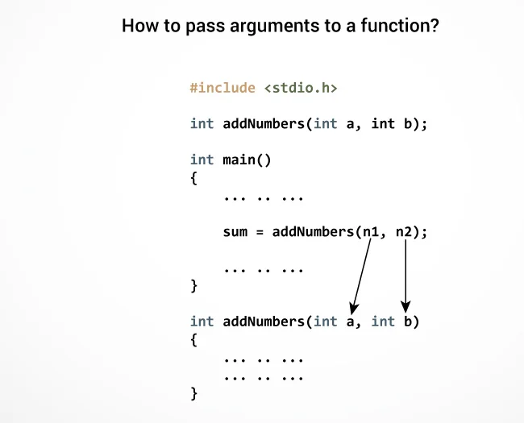

# Introduzione a C

## Table of Contents

-   [Introduzione a C](#introduzione-a-c)
    -   [Table of Contents](#table-of-contents)
    -   [Tipi di dato](#tipi-di-dato)
    -   [Regole di scrittura](#regole-di-scrittura)
    -   [Sintassi per dichiarazione delle variabili](#sintassi-per-dichiarazione-delle-variabili)
        -   [Assegnamento variabili](#assegnamento-variabili)
    -   [Operatori aritmetici e di casting](#operatori-aritmetici-e-di-casting)
        -   [Operatori aritmetici](#operatori-aritmetici)
        -   [Operatore di casting](#operatore-di-casting)
    -   [Operatori Logici Booleani](#operatori-logici-booleani)
    -   [Astrazione procedurale](#astrazione-procedurale)
        -   [Main function](#main-function)
        -   [Scanf](#scanf)
        -   [Printf](#printf)
-   [Astrazione sul controllo](#astrazione-sul-controllo)
    -   [If](#if)
        -   [Caso 1](#caso-1)
        -   [Caso 2](#caso-2)
        -   [Caso 3](#caso-3)
    -   [Loops](#loops)
        -   [For](#for)
        -   [While](#while)
        -   [Do-while](#do-while)
    -   [Numeri random](#numeri-random)
        -   [Rand](#rand)
        -   [Srand](#srand)
    -   [Vettori](#vettori)
    -   [Matrici](#matrici)
-   [Puntatori](#puntatori)
    -   [Dichiarazione di puntatori](#dichiarazione-di-puntatori)
    -   [Operatore \&](#operatore-)
    -   [**Operatore \***](#operatore--1)
        -   [Esempio](#esempio)
        -   [Puntatori con vettori](#puntatori-con-vettori)
    -   [Stringhe (Array di caratteri)](#stringhe-array-di-caratteri)
        -   [strlen()](#strlen)
        -   [gets()](#gets)
        -   [puts()](#puts)
        -   [strcpy()](#strcpy)
        -   [strncpy()](#strncpy)
        -   [strcat()](#strcat)
        -   [strncat()](#strncat)
        -   [strcmp()](#strcmp)
-   [Funzioni](#funzioni)
    -   [Definire e chiamare una funzione](#definire-e-chiamare-una-funzione)
    -   [Return nelle funzioni](#return-nelle-funzioni)
    -   [Passaggio di parametri](#passaggio-di-parametri)
        -   [Passaggio per valore](#passaggio-per-valore)
        -   [Passaggio per riferimento](#passaggio-per-riferimento)
-   [Operazioni su sequenze](#operazioni-su-sequenze)
    -   [Ricerca completa](#ricerca-completa)
    -   [Ricerca Binaria](#ricerca-binaria)
    -   [Inserimento all'inizio](#inserimento-allinizio)
    -   [Inserimento alla fine](#inserimento-alla-fine)
    -   [Inserimento diretto](#inserimento-diretto)
    -   [Cancellazione](#cancellazione)
-   [Esercizi da svolgere:](#esercizi-da-svolgere)

## Tipi di dato

-   `int`: Integer type (%d)
-   `short int`: Short integer type (%hd)
-   `long`: Long integer type (%ld)
-   `long long`: Long long integer type (%lld)
-   `float`: Single-precision floating-point type (%f)
-   `double`: Double-precision floating-point type (%lf)
-   `long double`: Extended-precision floating-point type (%lf)
-   `char`: Character type (%c) <br>

    **Unsigned Types**

-   `unsigned int`: Unsigned Integer type (%u)
-   `unsigned short`: Unsigned Short integer type (%hu)
-   `unsigned long`: Unsigned Long integer type (%lu)
-   `unsigned long long`: Unsigned Long long integer type (%llu)

## Regole di scrittura

-   Indentazione
-   Nome significativo delle variabili
-   Commenti nel caso fossero necessari
-   Evitare l'uso di codici superflui
-   Utilizzo graffe
-   Salto delle righe tra dichiarazione e corpo del codice

## Sintassi per dichiarazione delle variabili

Specificatore tipo (int, float, char) + nome variabile (o lista di variabili separate da una virgola) + ;

```C
int x, y;
```

<div style="page-break-after: always"></div>

### Assegnamento variabili

Specificatore tipo (int, float, char) + nome variabile (o lista di variabili separate da una virgola) +

```C
int x = 2;
int y = 5;

y = x;
```

## Operatori aritmetici e di casting

### Operatori aritmetici

-   **+**: somma;
-   **-**: differenza;
-   **\***: moltiplicazione;
-   **/**: diviso;
-   **%**: modulo (ritorna il resto di una divisione).

### Operatore di casting

Operatore che mi permette di cambiare il tipo di dato in un altro.

```C
#include <stdio.h>

int main() {
    int a = 5, b = 4;
    float c;

    c = (float) (a+b)/2;
    printf("La media è : %f", c );
}
```

> Nonostante sia un'operazione tra interi riusciamo ad ottenere i decimali risultanti da quella operazione.

<div style="page-break-after: always"></div>

## Operatori Logici Booleani

-   **AND** &&
-   **OR** ||
-   **NOT** !

| A   | B   | A AND B | A OR B | NOT A |
| --- | --- | ------- | ------ | ----- |
| 0   | 0   | 0       | 0      | 1     |
| 0   | 1   | 0       | 1      | 1     |
| 1   | 0   | 0       | 1      | 0     |
| 1   | 1   | 1       | 1      | 0     |

> Esiste anche il tipo di dato bool che permette di memorizzare "vero" o "falso" all'interno delle variabili; per poterlo utilizzare è necessario include la libreria `#include <stdbool.h>`.

## Astrazione procedurale

Il programma viene suddiviso in funzioni.

### Main function

La funzione main è l'unica funzione che viene eseguita autonomamente e la sua presenza è indispensabile per il funzionamento del programma.

```C
#include <stdio.h>

int main(void) {


    return 0;
}
```

-   void: indica che nella funzione non sono presenti dei parametri

-   return 0;: se viene eseguito tutto correttamente la funzione ritorna il valore 0 (il valore è un intero perchè la funzione è di tipo int).

### Scanf

Funzione di input, che serve per inserire dei dati, tramite tastiera, all'interno del programma

```C
#include <stdio.h>

main() {
    int a = 0;

    scanf("%identificatore", &a);
}
```

In questo caso sto prendendo in input un valore da tastiera e lo sto assegnando alla variabile `a`, questa cosa non avviene direttamente, ma mediante l'operatore `&` che serve per indicare l'indirizzo della variabile.

### Printf

Questa funzione serve a mostrare a video una frase o una variabile, anche un questi caso si ricorre all'utilizzo degli indentificatori.

```C
#include <stdio.h>

main() {
    int a = 7;

    printf("La variabile a, ha valore: %d", a);
}
```

> Output del programma:
>
> La variabile a, ha valore: 7

<div style="page-break-after: always"></div>

# Astrazione sul controllo

## If

Il blocco if serve e eseguire un'operazione nel caso venga verificata o meno una condizione. Letteralmente il blocco if significa "se la condizione è vera, fai questo, altrimenti non farlo o fai qualcos'altro".

### Caso 1

```C
    if(condizione){
        "fai qualcosa";
    }
```

In questo caso il blocco if esegue solo l'operazione solo se la condizione viene verificata.

### Caso 2

```C
    if(condizione){
        "fai qualcosa";
    }else{
        "fai altro";
    }
```

In questa situazione se la condizione non viene rispettata viene svolta un'altra operazione.

### Caso 3

```C
    if(condizione){
        "fai qualcosa";
    }else if(condizione 2){
        "fai altro";
    }else{
        "fai altro ancora";
    }
```

In questo caso se la prima condizione non viene verificata, controlla la seconda, se anche questa non viene verificata esegue l'operazione nel blocco `else`.

<div style="page-break-after: always"></div>

## Loops

Blocchi che permettono di iterare delle operazioni. Esistono 3 differenti loops:

-   for
-   while
-   do-while

### For

Il for è il ciclo con contatore.

```C
    for (int i = 0; i < 100; i++) {
        "operazione da eseguire fino a quando i >= 100";
    }
```

Il ciclo for è costituito da un header e un body. All'interno dell'header c'è l'inizializzazione della variabile contatore, la condizione di permanenza e l'incremento (o decremento) della variabile. Nel body vengono eseguite le operazioni da ripetere.

### While

```C
    while (condizione) {
        "fai qualcosa dopo aver controllato la condizione";
    }
```

Il while controlla sempre prima la condizione prima di eseguire l'operazione al suo interno.

### Do-while

Il do-while è un loop a condizione finale, questo garantisce che il codice al suo interno venga eseguito almeno una volta; questo perchè se la condizione viene verificata il loop continua, fino a quando non viene più rispettata.

```C
    int x = 0;
    do{
        scanf("%d", &x);
    }while(x<100);
```

In questo do-while l'operazione `scanf` viene ripetuta fino a quando il valore di x non supera 99.

<div style="page-break-after: always"></div>

## Numeri random

### Rand

La funzione rand genera un numero pseudo-casuale nell'intervallo da 0 a RAND_MAX. Per ottenere numeri in un intervallo specifico, è possibile utilizzare l'operazione modulo (%). Prima di utilizzare rand, è necessario inizializzare il generatore di numeri casuali con srand.

```C
#include <stdio.h>
#include <stdlib.h>
#include <time.h>

int main() {
    // Generazione di un numero casuale compreso tra 0 e RAND_MAX
    int numeroCasuale = rand();

    // Generazione di un numero casuale compreso tra 1 e 100
    int numeroCasualeLimitato = rand() % 100 + 1;

    printf("Numero casuale: %d\n", numeroCasuale);
    printf("Numero casuale tra 1 e 100: %d\n", numeroCasualeLimitato);

    return 0;

}
```

### Srand

La funzione srand viene utilizzata per inizializzare il generatore di numeri casuali. Di solito, si utilizza come argomento il valore restituito dalla funzione time(NULL). Ciò consente di generare sequenze di numeri casuali diverse ad ogni esecuzione del programma.

```C
#include <stdio.h>
#include <stdlib.h>
#include <time.h>

int main() {
    // Inizializzazione del generatore di numeri casuali
    srand(time(NULL));

    // Resto del codice

    return 0;

}
```

<div style="page-break-after: always"></div>

## Vettori

I vettori sono strutture dati che consentono di memorizzare più elementi dello stesso tipo in una singola variabile. La dichiarazione di un vettore avviene specificando il tipo degli elementi e la dimensione del vettore.

```C
#include <stdio.h>

int main() {
    // Dichiarazione e inizializzazione di un vettore di interi
    int numeri[5] = {1, 2, 3, 4, 5};

    // Accesso agli elementi del vettore
    printf("Elemento 0: %d\n", numeri[0]);
    printf("Elemento 1: %d\n", numeri[1]);

    return 0;

}
```

## Matrici

Una matrice è una struttura bidimensionale che può essere vista come un vettore di vettori. La dichiarazione di una matrice avviene specificando il tipo degli elementi e le dimensioni della matrice.

```C
#include <stdio.h>

int main() {
    // Dichiarazione e inizializzazione di una matrice di interi
    int matrice[3][3] = {
    {1, 2, 3},
    {4, 5, 6},
    {7, 8, 9}
    };

    // Accesso agli elementi della matrice
    printf("Elemento in posizione (1, 1): %d\n", matrice[1][1]);

    return 0;

}
```

<div style="page-break-after: always"></div>

# Puntatori

I puntatori sono variabili che contengono l'indirizzo di memoria di un'altra variabile. Consentono di manipolare direttamente la memoria, migliorando l'efficienza e la flessibilità del codice.
I puntatori sono variabili che contengono l'indirizzo di memoria di un'altra variabile. Consentono di manipolare direttamente la memoria, migliorando l'efficienza e la flessibilità del codice.

## Dichiarazione di puntatori

I puntatori vengono dichiarati utilizzando il simbolo \* seguito dal tipo di variabile a cui puntano. Ad esempio, la seguente dichiarazione dichiara un puntatore a una variabile di tipo int:

```C
int *p;
```

Questa dichiarazione alloca spazio per una variabile di tipo int, ma non assegna un indirizzo di memoria a tale variabile. Per assegnare un indirizzo di memoria a un puntatore, è necessario utilizzare l'operatore &.

## Operatore &

L'operatore & viene utilizzato per ottenere l'indirizzo di memoria di una variabile. Ad esempio, la seguente istruzione assegna l'indirizzo di memoria della variabile x al puntatore p:

```C
int x = 10;
int *p = &x;
```

Dopo questa istruzione, il puntatore p contiene l'indirizzo di memoria della variabile x. Questo indirizzo può essere utilizzato per accedere al valore di x utilizzando l'operatore \*.

## **Operatore \***

L'operatore \* viene utilizzato per accedere al valore a cui punta un puntatore. Ad esempio, la seguente istruzione stampa il valore della variabile x utilizzando il puntatore p:

```C
int x = 10;
int \*p = &x;

printf("%d\n", \*p);
```

> Questa istruzione stampa il valore 10.

<div style="page-break-after: always"></div>

### Esempio

```C
#include <stdio.h>

int main() {
    // Dichiarazione di una variabile e di un puntatore
    int x = 10;
    int \*puntatoreX;

    // Inizializzazione del puntatore con l'indirizzo di x
    puntatoreX = &x;

    // Accesso al valore di x tramite il puntatore
    printf("Valore di x: %d\n", *puntatoreX);

    // Modifica del valore di x tramite il puntatore
    *puntatoreX = 20;

    // Stampa del nuovo valore di x
    printf("Nuovo valore di x: %d\n", x);

    return 0;

}
```

I puntatori sono particolarmente utili nell'allocazione dinamica della memoria e nelle funzioni che devono modificare direttamente i valori delle variabili.

### Puntatori con vettori

```C
#include <stdio.h>
#define DIM 5

int main(){
    // dichiaro vettore
    int v[DIM];

    // dichiaro puntatore
    int* p;

    /* p = &v[0]: il valore del puntatore p è
    inizializzato al primo byte del vettore */
    for(p = &v[0]; p < v[DIM]; p++){
        // inizializzo il vettore tramite il puntatore
        *p = 0;
    }
}
```

## Stringhe (Array di caratteri)

In C non esistono le "stringhe" in quanto le parole e le frasi vengono memorizzati come array di caratteri. Gli array vengono dichiarati mediante il tipo di dato `char`.

```C
#include <stdio.h>
#define DIM 21

int main(){
    char parola[DIM];
    int len = strlen(parola);

    for(int i = 0; i < len; i++){
        parola[i] = '-';
    }
}
```

In questo esempio vediamo come inizializzare un char array; notiamo che nella dichiarazione inserisco nelle parentesi quadre la dimensione.

> La dimensione DIM è 21, questo significa che possiamo accettare della parole lunghe al massimo 20 caratteri in quanto nei char array l'ultima posizione è riservata per il carattere di fine stringa `\0`.

### strlen()

La funzione strlen consente di trovare la lunghezza della stringa.

### gets()

La funzione `gets()` ha la stessa funzione di `scanf()`, ma prende tutti i caretteri inseriti dall'utente, compresi gli spazi. Questo non avviene utilizzando `scanf()` in quanto lo spazio viene considerato come un "invio".

> NB! [`fgets()` migliore](https://www.geeksforgeeks.org/fgets-gets-c-language/).

### puts()

La funzione `puts()` ha la stessa funzione di `printf()`, ma solo per le stringhe.

<div style="page-break-after: always"></div>

### strcpy()

```C
char* strcpy(str2, str1);
```

Serve a copiare una stringa all'interno di un'altra.
La funzione ritorna il puntatore della stringa in cui viene copiata la prima.

```C
#include <stdio.h>
#include <string.h>

int main() {
  char str1[20] = "C programming";
  char str2[20];

  // copia str1 in str2
  strcpy(str2, str1);

  puts(str2);

  return 0;
}
```

### strncpy()

Funziona come `strcpy()`, ma ammette un altro parametro di tipo intero che permette di specificare quanti char copiare.

```C
char* strncpy(char*, char*, int);
```

### strcat()

```C
char* strcat(char*, char*);
```

Funzione che permette di concatenare due stringhe (quindi di "sommarle").
Il primo parametro corrisponde alla stringa di destinazione e il secondo alla stringa asorgente. Il valore che ritorna è la stringa di destinazione (posso concatenare la funzione).

```C
char str1[4] = "abc";
char str2[7] = "def";
strcat(str2, str1);
```

> risultato: "d e f a b c \0"

### strncat()

```C
char* strncat(char*, char*, int);
```

```C
#include <stdio.h>
#include <string.h>

int main () {
   char src[50], dest[50];

   strcpy(src,  "This is source");
   strcpy(dest, "This is destination");

   strncat(dest, src, 15);

   printf("Final destination string : %s", dest);

   return(0);
}
```

> Final destination string : This is destinationThis is source

### strcmp()

Funzione che viene utilizzata per comparare le due stringhe.

-   **ritorna 0** se le stringhe sono identiche
-   **ritorna un numero > 0** se il primo carattere non identico ha un valore ASCII maggiore del secondo
-   **ritorna un numero < 0** se il primo carattere non identico ha un valore ASCII minore del secondo

# Funzioni

Fino ad ora abbiamo scritto i nostri programmi utilizzando solo la funzione main: si può (e si deve), invece, suddividere il programma in blocchi di codice che risolvono specifiche task. Dividendo il programma in blocchi rende più facile la comprensione e la manutenzione del programma. Ci sono due tipi di funzioni, quelle standard, definite "dal linguaggio ci programmazione" che già conosciamo, `scanf(), printf()` etc. e **quelle definite dall'utente**.

## Definire e chiamare una funzione

```C
#include <stdio.h>
int nomeFunzione("eventuali parametri")
{
    ... .. ...
    ... .. ...
}

int main()
{
    ... .. ...
    ... .. ...
    // chiamata della funzione
    nomeFunzione();
    ... .. ...
    ... .. ...
}
```

Si può definire anche in modo diverso, creando prima un prototipo della funzione:

```C
#include <stdio.h>
int nomeFunzione("eventuali parametri");

int main()
{
    ... .. ...
    ... .. ...
    nomeFunzione();
    ... .. ...
    ... .. ...
}

int nomeFunzione("eventuali parametri"){
    // operazioni da svolgere
}
```

## Return nelle funzioni

Una volta che la funzione viene eseguita è previsto un `return` che permette di ritornare il risultato della funzione, appena eseguita, alla funzione main, per magari memorizzarla all'interno di una variabile. Il **tipo di dato** ritornato dalla funzione dipende dal **tipo della funzione**, se una funzione è di tipo `int` allora dovrà ritornare una variabile di tipo int e così via.

## Passaggio di parametri

Per fare in modo che le funzioni siano effettivamente utili dobbiamo passare dei **parametri** in modo che la funzione possa lavorare su qualcosa:

```C
#include <stdio.h>
int somma(int a, int b);         // prototipo funzione

int main()
{
    int n1, n2, risultato;

    printf("Enters two numbers: ");
    scanf("%d %d",&n1,&n2);

    // chiamata funzione e memorizzazione del valore nella variabile risultato
    risultato = somma(n1, n2);
    printf("somma = %d", risultato);

    return 0;
}

// i parametri n1 e n2 prendono il nome di a e b
int somma(int a, int b)         // definizione funzione
{
    int risultato;
    risultato = a+b;

    return risultato;                  // return
}
```



In C, quando si passa un argomento a una funzione, si può passare il valore dell'argomento o il suo riferimento.

### Passaggio per valore

Quando si passa un argomento per valore, la funzione riceve una copia del valore dell'argomento. Qualsiasi modifica apportata all'argomento all'interno della funzione non ha alcun effetto sull'argomento originale.

Ad esempio, la seguente funzione somma due numeri:

```C
int somma(int a, int b) {
  int c = a + b;
  return c;
}
```

Se chiamiamo questa funzione con gli argomenti `a` e `b`, la funzione creerà una loro copia e la passerà come argomenti. All'interno della funzione, la somma dei due numeri verrà calcolata e il risultato verrà restituito. Tuttavia, la variabile `a` nella chiamata alla funzione rimarrà uguale a 1 e la variabile `b` rimarrà uguale a 2.

```C
int main() {
  int a = 1;
  int b = 2;

  int c = somma(a, b);

  printf("a = %d\n", a);
  printf("b = %d\n", b);
  printf("c = %d\n", c);

  return 0;
}
```

> L'output di questo programma è il seguente: <br>
> a = 1 <br>
> b = 2 <br>
> c = 3 <br>

### Passaggio per riferimento

Quando si passa un argomento per riferimento, la funzione riceve un puntatore all'argomento. Qualsiasi modifica apportata all'argomento all'interno della funzione si rifletterà sull'argomento originale.

Per indicare che un argomento deve essere passato per riferimento, si usa l'asterisco davanti al tipo di dato dell'argomento. Ad esempio, la seguente funzione somma due numeri passandoli per riferimento:

```C
void somma_per_riferimento(int *a, int *b) {
  int c = *a + *b;
  *a = c;
  *b = c;
}
```

Se chiamiamo questa funzione con gli argomenti 1 e 2, la funzione riceverà un puntatore a 1 e un puntatore a 2. All'interno della funzione, la somma dei due numeri verrà calcolata e il risultato verrà memorizzato nell'argomento a. Quindi, il valore di a verrà aggiornato a 3 e il valore di b verrà aggiornato a 3.

```C
int main() {
  int a = 1;
  int b = 2;

  somma_per_riferimento(&a, &b);

  printf("a = %d\n", a);
  printf("b = %d\n", b);

  return 0;
}
```

> L'output di questo programma è il seguente: <br>
> a = 3 <br>
> b = 3 <br>

# Operazioni su sequenze

## Ricerca completa

```C
#include <stdio.h>
#define DIM 10

int main(){
    int v[DIM] = {1, 2, 3, 4, 5, 6, 7, 8, 9, 10};
    int x = 5;
    int i = 0;

    while(i < DIM && v[i] != x){
        i++;
    }

    if(i < DIM){
        printf("Elemento trovato in posizione %d", i);
    }else{
        printf("Elemento non trovato");
    }
}
```

## Ricerca Binaria

```C
#include <stdio.h>
#define DIM 10

int main(){
    int v[DIM] = {1, 2, 3, 4, 5, 6, 7, 8, 9, 10};
    int x = 5;
    int i = 0;
    int j = DIM - 1;
    int m;

    while(i <= j){
        m = (i + j) / 2;
        if(v[m] == x){
            printf("Elemento trovato in posizione %d", m);
            break;
        }else if(v[m] < x){
            i = m + 1;
        }else{
            j = m - 1;
        }
    }

    if(i > j){
        printf("Elemento non trovato");
    }
}
```

## Inserimento all'inizio

```C
int inserimento_inizio(int vet[], int n, int nuovo) {
    if (n < DIM) {
        vet[n++] = vet[0];
        vet[0] = nuovo;
    }
    else printf("\nWarning: Array is full");

    return n;
}
```

## Inserimento alla fine

```C
int inserimento_fine(int vet[], int n, int nuovo) {
    if (n < DIM) vet[n++] = nuovo;
    else printf("\nWarning: Array is full");
    return n;
}
```

## Inserimento diretto

```C
int inserimento_diretto (int vet[], int n, int nuovo) {
    int i, j;
    for (i = 0; i < n && vet[i] < nuovo; i++);
    for (j = n; j > i; j--) vet[j] = vet[j-1];
    vet[i] = nuovo;
    return ++n;
}
```

## Cancellazione

# Esercizi da svolgere:

[Pdf esercizi Università della Calabria](https://www.mat.unical.it/spataro/teaching/InformaticaChimica/esercizi_di_programmazione_in_c.pdf)
